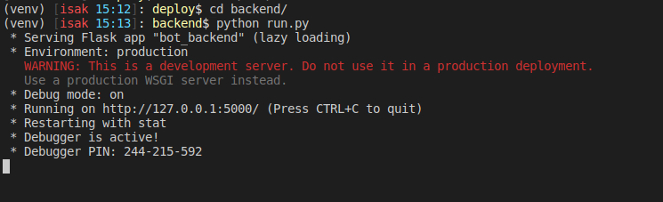
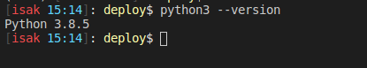

# Running instructions for python server

## All times
### Database usage
To use the database read through the [quickstart guide](https://flask-sqlalchemy.palletsprojects.com/en/2.x/quickstart/). This will teach you the basics of SQLAlchemy. It is good to have some experience with SQL databases as SQLAlchemy uses a SQL (SQLite in our case) database. The actual database is stored in the file `database.db` in the bot_framework folder. If you want to reset the database navigate to `deploy/backend/` and run: 
```Bash
python resetDB.py
```
This will remove all database entries. The database is not, and should not be, version handled. It is included in .gitignore and should therefore not be manually added. This is because different programmers will need different data in their databases for testing purposes. 
### Windows
1. Navigate to "deploy" inside of a powershell terminal.
2. Run the command `venv\scripts\Activate.ps1`. A "(venv)" should pop up in front of your command line prompt.


3. To run the server run run the following commands:
```PowerShell
cd backend
python run.py
```


You should now be able to access the routes defined in bot_backend/\_\_init\_\_.py. Test this by visiting [localhost:5000/available-times]() in a browser.

### Linux (and probably mac os)
1. Navigate to "deploy" inside of a terminal.
2. Run the command `source venv/bin/activate`. A "(venv)" should pop up in front of your command line prompt.


3. To run the server run the following commands:
```PowerShell
cd backend
python run.py
```


## First time
### Opening a terminal inside of vs code


### Windows
1. Install [Python](https://www.python.org/downloads/). Choose a version greater than 3.8.
2. Try running the command `python3 --version` in powershell. This can be done inside of vscode by opening a terminal. The command should output `Python 3.x.x`. If it doesn't find the install path of python3, locate it. Mine was installed in `C:\Users\USERNAME\AppData\Local\Programs\Python\Python3VERSION`. Copy the found path. To test it, you can run `C:\PATH\TO\PYTHON\python.exe --version`. It should output the same thing as below, maybe with a differing verison number.




3. Navigate to the folder "deploy" (The project folder) inside of powershell.
4. Run the following commands:
```PowerShell
python3 -m venv venv
venv\scripts\Activate.ps1
pip install -r requirements.txt
```
Or, if you used the long path:
```PowerShell
C:\PATH\TO\PYTHON\python.exe -m venv venv
venv\scripts\Activate.ps1
pip install -r requirements.txt
```
5. Proceed to instructions for running "All times" in the beginning of this document.
### Linux (and probably mac os)
1. Python is probably already installed on your computer. To verify, run `python3 --version` in a terminal. It should output `Python 3.x.x`. Make sure that the version is greater than 3.8. Otherwise, install a version of python that is greater than 3.8.


2. Navigate to the folder "deploy" (the project folder) inside of a terminal. This can be done inside of vscode by opening a terminal, or in any other terminal.
3. Run the following commands
```Bash
python3 -m venv venv
source vevn/bin/activate
pip install -r requirements.txt
```
4. Proceed to instructions for running "All times" in the beginning of this document.