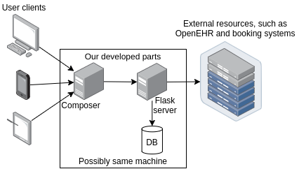
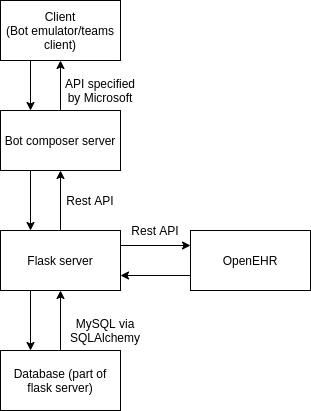
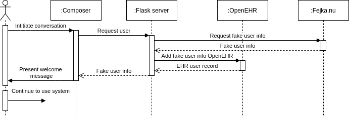
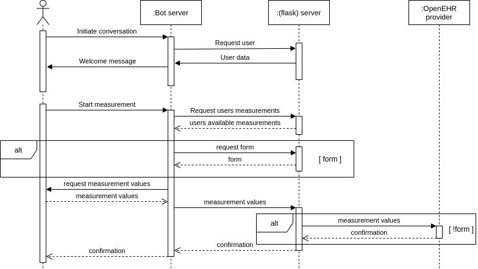

# Architecture Overview

    Document Status: Finished
    Inspected by: Filip Nyberg (Quality Coordinator) & Ola Friberg (Technical Writer) on 2020-12-09
    Contact Person: Isak Almquist (Architect)
    Written by: Isak Almquist (Architect)
    Manager: Björn Bergfeldt

## Table of contents

- [Architecture Overview](#architecture-overview)
  - [Table of contents](#table-of-contents)
  - [Purpose](#purpose)
  - [Architecture](#architecture)
    - [Overview](#overview)
    - [Composer](#composer)
    - [Emulator/Teams](#emulatorteams)
    - [Flask server](#flask-server)
  - [User creation](#user-creation)
  - [Measurement/form registration](#measurementform-registration)

## Purpose

The purpose of this document is to communicate how the system works to anyone
who, after our development stops, will work with or read our code.

This will be done through descriptions of:
* The architecture
* The "User creation" part
* The "measurement/form registration" part

## Architecture

### Overview

The system consists of two servers, one hosting the bot (from here on refered to
as Composer) and one serving the bot server with data and simplifying
some complex HTTP requests (from here on referred to as flask server).

- Composer connects to clients and the extra server 
- The flask server connects to OpenEHR and a database

Clients are either
[Microsoft Bot Framework Emulator](https://github.com/microsoft/BotFramework-Emulator)
clients or Microsoft Teams clients. These two tools are both chat clients, that only
connect to composer directly. No direct communication to the flask server is
made from these clients.

### Composer

Composer is a tool for designing bots without code. It is essentially block 
programming for bots and allows for some pretty complex interactions. All bot logic is programmed in composer. This made development simple in many ways but it also did limit the development in others. Some of those limitations
forced us to use the flask server for implementing parts that could not be implemented in composer.

### Emulator/Teams

Microsoft Bot Framework Composer and Teams only acts as ready-made clients in
our case. None of these are programmed by us apart from creating the connection.
Therefore we will not go in depth about them in this document since there are 
better official documentation for these two tools. 

### Flask server

The flask server is used for three different reasons:

1. To simulate access to external resources, such as RÖ's scheduling software.
2. To provide authentication of users.
3. To provide functionality that Microsoft Bot Framework Composer does not.

The simulation of access to external resources is done by approximating an
interface that the bot might use. This interface is for example used to gather
available times for booking a consultation or a database for storing
notification preferences.

The authentication of users was never implemented due to time constraints.
Ideally it would have been made through an OAuth endpoint, which would allow
users to authenticate themselves through our server. In a more "real"
implementation this authentication would be done by RÖ or an external party.

Microsoft Bot Framework Composer has a way of making HTTP requests. The HTTP
requests Composer allows us to make are hard to get right and while they do
allow for complex requests, it is hard to execute them right. For example,
adding conditions and data that depends on user choices is very cumbersome. By
making the requests to an external resource we avoid these problems and this
also gives us an easy way to execute actual code. In this project it will be
used as a way to make more complex HTTP requests to the OpenEHR server. This
brings additional complexity in the form of more nodes in the network, but our
assessment is that the extra complexity pays off in the form of not having to
implement complex operations in Composer, which has very limited programming
capabilities.

Flask was chosen as the server framework for no other reason than that it
fulfilled our requirements and that parts of the development team had worked
with it before.

## User creation

A sequence diagram of the user creation is presented above. The user initiates
communication with Composer. Composer then requests a user from the flask server.
The flask server requests user data from an external service,
[Fejka.nu](fejka.nu), which provide fake user data. The flask server then
creates a patient entry with the data in OpenEHR and sends that patient's info
back to Composer which displays a welcome message to the user.

## Measurement/form registration

The measurement and form registration is presented in the above sequence diagram.

There are definite problems with our approach to this problem. These include:
* Measurements are stored in different places
* The dialog logic for each measurement must be written in composer, while communication logic must be written in the flask server and storage logic is implemented in OpenEHR

The fact that measurements are stored in different places is a product of us not
beeing able to store our form responses in OpenEHR. We simply opted to store
them in a SQL database instead. A single place for storage would decrease error
risk and simplify further development.

To create a new measurement, a developer has to first create a new dialog in
Composer that is made to register that measurement. The developer then has to
implement the communication logic between Composer and the flask server and then
finally make sure that OpenEHR can store the data and that the flask server
makes the correct requests to OpenEHR. This is an error prone process and it
requires a developer that knows all previously presented tools. Some suggestions
for a better process is to implement a tool that manages all this. That tool
would probably be easier to implement if there were one single server that
handled both the communication parts and the conversation logic. Another
possibility is to add configuration files that could be read by the bot and
communication logic. If this is to be implemented as a real product, this will
need to be taken into consideration, the current implementation is not viable
long term.
