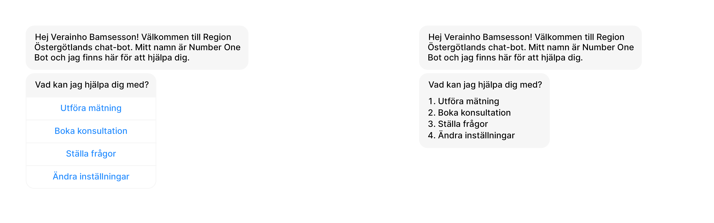

# **Future Development**

    Document Status: Finished
    Inspected by Filip Nyberg (Quality Coordinator)
    Contact Person: Alve Rybom (Analyst)
    Written by: Alve Rybom (Analyst), Tintin Andersson (Analyst), Agnes Öberg (Analyst)
    Manager: William Bergekrans (Lead Analyst)

## Log history:

| **Date** | **Version number** | **Description** | **Changes made by** |
| --- | --- | --- | --- |
| **2020-12-08** | **2.0** | **Inspection performed. Final version.** | **Filip Nyberg** |
| **2020-12-08** | **1.10.1**| **Added to 4.10: what NLP is, the benefits of implementation** | **Alve Rybom** | 
| **2020-12-08** | **1.10**| **Section 4.10 on natural language procesing update about LUIS** | **William Bergekrans** | 
| **2020-12-06** | **1.9** | **Section 4.10 on natural language processing and update in 2.2** | **William Bergekrans** |
| **2020-12-03** | **1.8** | **Added section 2.2** | **William Bergekrans** |
| **2020-12-03** | **1.7** | **Added sections 2.3, 3, 3.1, 3.2. Edited 4.6, removed 4.10** | **Alve Rybom** |
| **2020-12-03** | **1.6** | **Added section 2.1** | **Agnes Öberg** |
| **2020-12-03** | **1.5** | **Added headers for 2, 2.1, 2.2 and 2.3** | **Agnes Öberg** |
| **2020-12-02** | **1.4.2** | **Added draft of new introduction & changed document title** | **Tintin Andersson** |
| **2020-11-29** | **1.4.1** | **Added draft for section 2.10** | **Alve Rybom** |
| **2020-11-29** | **1.4** | **Added text to section 2.9** | **Agnes Öberg** |
| **2020-11-26** | **1.3** | **Added text to section 2.8** | **Tintin Andersson** |
| **2020-11-16** | **1.2** | **Added headers and text for Bot handover, Image recognition, Admin panel, Messenger, and Webhooks** | **Alve Rybom** |
| **2020-11-16** | **1.1** | **Added placeholder headers, wrote 2.1.1** | **Alve Rybom** |
| **2020-11-11** | **1.0** | **Original version** | **Alve Rybom** |

## Table of contents
[**1. Introduction**](#introduction)  

[**2. System aspects**](#systemaspects)  
&nbsp;&nbsp;[2.1 Scalability](#scalability)  
&nbsp;&nbsp;[2.2 Support](#support)  
&nbsp;&nbsp;[2.3 Maintenance](#maintainance)  

[**3. Minor functionality**](#minorfunctionality)  
&nbsp;&nbsp;[3.1 Fixing form responses](#formresponse)  
&nbsp;&nbsp;[3.2 Assisting user in finding answers on 1177](#1177)  

[**4. Features In An Expanded Solution**](#featuresexpandedsolution)  
&nbsp;&nbsp;[4.1 Voice Features](#voicefeatures)  
&nbsp;&nbsp;&nbsp;&nbsp;[_4.1.1 Smart home integration_](#smarthome)  
&nbsp;&nbsp;[4.2 Trend Analysis](#trendanalysis)  
&nbsp;&nbsp;&nbsp;&nbsp;[_4.2.1 Self-tailoring to the user_](#selftailoring)  
&nbsp;&nbsp;[4.3 Bot Handover To Human Interaction](#bothandover)  
&nbsp;&nbsp;[4.4 Image recognition](#imagerecognition)  
&nbsp;&nbsp;[4.5 Admin panel](#adminpanel)  
&nbsp;&nbsp;[4.6 Messenger](#messenger)  
&nbsp;&nbsp;[4.7 Webhooks](#webhooks)  
&nbsp;&nbsp;[4.8 Validation](#validation)  
&nbsp;&nbsp;[4.9 Notifications](#notifications)  
&nbsp;&nbsp;[4.10 Natural Language Processing](#NLP)  

[**5. References**](#references)

## 1. Introduction 

This document exists to highlight what we in Number One Company believe to be the next steps our product needs to take in order to become a complete solution. We present features that have been deemed too time consuming to implement in our solution as well as features we feel would improve user experience, general utility and accessibility of the chat bot. Some of the features are ready to start production right away whilst other features in this document have not yet been evaluated. 

We believe that with the addition of even just a few of these features described below, the customer satisfaction will increase immensely. Our hopes are that with the help of this document any future development will be as seamless and easy to implement as possible. The features listed in this document are not listed in any specific order, therefore we recommend that each feature be evaluated on its own merits before commiting to any development. 

## 2. System aspects 
This section aims to assist future development by documenting the system's scalability, support, and maintainability. Under each header, the aspect is defined, the current situation is detailed, and recommendations are given.

### 2.1 Scalability 
Scalability is the ability of a program to scale and still maintain its performance. A program is scalable if it does not need to be redesigned after an increase in workload and is therefore able to grow and change with the user’s demands [1]. Increased workload for this chatbot could mean that a larger number of patients uses the system simultaneously or that more features need to be added, which definitely could be a possible outcome for this solution.

For a system to be scalable it is important that the architecture is modular, which means that the functionality in the program should be separated into distinct and independent units. This enables reusing the code efficiently and decreases the complexity and makes it easier to understand [2]. Therefore, a modular system facilitates an expansion of the system and thus the ability to scale up the system. The Microsoft Bot Framework used in this project is widely used by others and is therefore designed to scale properly, at least when it comes to the amount of users. This framework is therefore seen as a good option for this solution.

When it comes to scalability regarding the number of features it gets more complex. First of all the system shall be gathered in one complete system so that there is only one system responsible for the communication with the server. It is important to use methods that are scalable between the different units, for example is HTTP-methods good to use for the communication between the client and server. The features should also be developed in a more standardized way, for example register measurements should be standardized to make it easy to expand and add new types of measurements.

Furthermore, the choice of chatbot interface can also affect the scalability. For this project Microsoft Teams was chosen, but other choices could have been Messenger, Slack, WhatsApp and other interfaces Microsoft Bot Framework supports. The advantage of using these platforms is that they are easy to use, but the disadvantages are that they have lots of restrictions to follow. These restrictions may affect the choice of functionality and the ability to add new features. Therefore, one should have in mind while developing a chatbot that the choice of interface could be very important. The system should also be modular enough so that the interface easily can be changed without affecting the backend functionality. This can for example be visualized by separating the chatbot module and conversation logic from the rest of the backend system.

### 2.2 Support 
It is important for a chatbot to have good supportability as it lowers operational costs and help with efficient product maintenance. The current implementation of the chatbot does not offer satisfactory supportability and this should be improved in a potential future version of the bot. 

The complexity of setup for the end user depends on the platform the user wants to access the bot on. The current implementation is available on two platforms, on a website and on Microsoft Teams. When implemented on a website the bot should perform in such a way that after implementation the user would not need to do anything as the bot would be present on all pages as a pop-up symbol. 

As will be discussed in section [4.6](#messenger) there is a strong argument to implement the bot in Facebook Messenger. This would require the users to have access to the Messenger app either on their smartphones or on Facebook's website. To our knowledge Facebook does not allow bots to start conversations with their users and the users have to find the bot and start a conversation. This does make the user experience a bit more complex for certain users that are not comfortable of finding for example Region Östergötland's Facebook page or does not already have an account on Facebook. 

The same limitations exist on Microsoft Teams as the user have to find the bot and start the conversation. To our knowledge, bots implemented on the common large platforms are not granted permission to find and write messages to users. This makes support a bit harder on these platforms in comparison to using the bot on the webpage, as navigation to the page is all that is required for the bot to initatie a conversation.  

Another important factor to consider is the ability of the system to trace errors and avoid serious malfunctions. The bot needs to be able to handle error in the dependent databases and properly inform the user if for example it is not possible to store measurements. When the system does crash it is important that logs are kept of the bots last interactions and what could be the cause of it. Both to be able to find bugs and recreate lost data. 

The chatbot as of now does not handle text input particularly well and can only answer a small set of questions, which is not enough in a potential release of a chatbot. It is likely that the users questions change over time into areas that the bot does not have answers for. In order to support the system in achieving user satisfaction the bot should store questions and commands it does not know how to answer. By using this data the developers can get fast feedback on what the users are actually asking the bot and what they cannot get done. These cases are not system crashes but they are situations that from the user's point of view can be seen as such and need to be dealt with if they are frequent. 

In section [4.3](#bothandover) bot to human handoff will be discussed and if such functionality would be desired it is natural to have such a department responisble for supporting users and keeping track of change in user needs. As most of the bot's functionality is directed towards practical needs of the user, such as booking and registering measurements the human staff tasked to this does not need to consist only of trained doctors. The effectively use scarce human resources the bot needs to be able to tell what kind of proffesional it should hand over the patient to, depending on the type of situation. Otherwise this functionality would most likely not be realistic to implement.  

[comment]: <> (As the bot interacts with outside systems to store measurements it also needs to be able to handle exceptions in these comunication without crashing or making weird decisions. Designing)

### 2.3 Maintenance 
A system’s maintainability determines how much effort it requires to understand, change, and test the code. The changes could be adding new functionality, altering existing functionality, or fixing bugs. To avoid growing pains and tech debt, maintainability is important to get right the first time, especially in a field like healthcare, where the ramifications of poorly made software are much larger and where changes in legislation can have large impacts on how software can be designed and how it can operate.

The system has been developed in Bot Framework Composer. It is easy to get an overview of the paths and which inputs result in a certain output, so the understandability is high. However, it’s not a good option in the long run because of the other aspects of maintainability. This hasn’t been a big problem so far, as the project is rather small, but as development continues, Composer’s shortcomings will become a bigger problem. We therefore suggest leaving Composer and instead editing the actual code. This can enable proper version control, testing, and debugging.

The system’s core functionality is mostly done, so the prospects for multiple parallel development branches is greater. This means that proper management of the software’s versions is important, to enable a more modern workflow. The system will get more complex as development progresses and the need to manage multiple versions is important for that too. A more complex software also necessitates more and higher quality testing and debugging due to the higher risk for bugs.

The chat bot is currently available on a web application and Microsoft Teams, with proposals to expand to smart home devices and Facebook Messenger. This fragmentation of chat bot availability has the potential to require a lot of effort in upkeep, which limits the time and resources for maintenance for other parts of the system. A good idea might therefore be to research how the users prefer to use the bot and focus the efforts on the more popular platforms.

## 3. Minor functionality 
This section is for functionality that always was intended to make it in to the system, but was cut due to time restraints.

### 3.1 Fixing form responses 
Currently, when the measurement registering flow is active and the user has submitted their values, the chatbot asks if it has understood the values correctly. The user can respond yes to save the values or no to input them again. However, the behavior is different in the health form flow: the chat bot saves the user’s responses without checking if they’re correct. Obviously, this increases the risk for mistakes never being corrected and inaccurate information being saved.

As getting a prompt to confirm every answer is tedious, a different approach is needed: perhaps by showing a summary of the responses and asking if all answers are correct before saving them, giving the user a chance to fix a mistake by answering no. The system could then ask which question got answered incorrectly and then repeat that question. When the user answers, they should be shown an updated summary and asked if all answers are accurate. This would repeat until all responses are correct.

### 3.2 Assisting user in finding answers on 1177 
The chat bot’s ability to answer questions is limited to a set of prepared questions. To get answers to other inquires, the user has to navigate the 1177 website themselves. As this might be confusing, our suggestion is that the chat bot could help the user find what they are looking for on 1177 as a provisional solution, before the [Admin panel](#adminpanel) detailed below is implemented. This could be done by identifying keywords from the user’s question and send a link to a search on 1177 with those keywords. 

## 4. Features in an expanded solution 
Each feature has its own sub header with a description, a reason for why it would be a good fit for the chat bot, and a suggestion of how the feature could be implemented.

### 4.1	Voice features 
Implementing voice features to navigate the interface and to chat with the bot, where the goal is to be able to use all functionality without having to use a keyboard or a mouse. Implementing this would be a big step forward in usability as it makes measuring more streamlined; the user can report values as they are taking them. It would also make the chat bot accessible for users who experience difficulty in using a keyboard and/or mouse.

A complaint that patients might have using the chat bot at its current stage is that they get less face-to-face time with their health care team. Implementing voice features might facilitate this by offering a more natural way to get assistance.

To reach the goal of users not needing to use a keyboard or a mouse, the option of using voice needs to be available as soon as the interface is opened, and it needs to be a toggle; the user should not need to click a button each time they want to use their voice for input. When a measurement is registered via voice, it’s important that the bot reads the value out loud and asking if it interpreted the value correctly.

#### 4.1.1	Smart home integration 
When it’s possible for the patient to use the whole self-monitoring system with their voice, the company would like to integrate the chat bot in a smart home device, such as Google Home or Amazon Alexa. Registering measurements by only reading the values on the instrument is a big step up in usability.

It would also reduce the likelihood of a patient missing their notification. By pushing the notifications to the smart home device, the patient can get the alert as long as they are within hearing distance of it. The feeling of face-to-face communication will also be improved with smart home integration.

One thing to keep in mind when the measurement process is carried out entirely without screen is that there’s a risk for misunderstandings, both for the user and the chat bot. Therefore, there needs to be a way for the user to get the bot to repeat what it said, and it’s extra important that the bot double checks all values before saving them.

### 4.2	Trend analysis 
Using data analysis tools to create models of how different treatments affect different patients, analyzing if different medications affect each other, and creating predictions from users’ reported values. Implementing this could make the chat bot a valuable tool for researchers studying the impacts and effectiveness of different treatments in general and for specific groups.

If the model predicts a patient’s measurements going outside the normal range, it could warn their health care team, so the patient gets preventative treatment. This could be a big improvement for both patients and those who take care of them.

The data that’s collected should be anonymized to the highest possible extent, and what data is collected must be completely up to the user. The settings should be opt-in, with granularity so that a patient can consent to the collection of their pulse but not their weight, for example. Apart from that, the data collection should not be visible to the user. 

#### 4.2.1	Self-tailoring to the user 
Right now, the bot needs to be tailored to each patient by their health care team. Some of the things that needs to be customized are how often measurements need to be registered by the user, and what constitutes as a deviating value for each measurement. We see a possibility to use artificial intelligence to automate this process, so the bot self-tailors to the user.

To get a concept of which measurements are necessary for a patient, trend analysis is a prerequisite for this function. As the effort to register a new patient is reduced, the chat bot could be made available to more people.

### 4.3	Bot handover to human interaction 
For tasks that the bot can’t do by itself, we want the bot to be able to handover the task to a health care worker. The employee should be able to reply directly in the conversation between the bot and the patient, so the transition is seamless to the user.

When inviting a health care professional into the chat, the bot should provide the person that’s joining some information about the patient, as well as the most recent messages, so the health care worker can assess the situation and come up with fitting follow-up questions and actions. One example of a task that could benefit by this expansion is when the user inputs a deviating value. If it could be an indication of that the patient’s condition has become worse, the bot should let a health care professional join the chat and take appropriate measures.

This expansion is comparatively simple code-wise. But since it involves creating an entirely new team of health care workers and new workflows, it will likely take a lot of time and effort to get right. The size of the team on call is important but difficult to get right, as it’s a balance between user experience and cost, both impacted by the number of man-hours spent by the team on call.

### 4.4	Image recognition 
This expansion of the chat bot aims to improve both speed and accuracy when registering values, by letting the user submit all values simultaneously with a picture of the measuring equipment.

The speed up of the registration procedure is a result of the fact that all values are inputted at once – there’s no need for neither user nor bot to wait on each other. The part when the bot asks for confirmation can be skipped completely, too. The improvement in accuracy is because no typos will make it into the patient’s file and because a faulty measurement is more likely to be caught and remedied as the bot can analyze all values at once, instead of one at a time.

The image recognition is not too advanced, the bot only needs to be able to pick out text and numbers from an image and there are already frameworks with good documentation for that. They must be modified to fit our needs though, so the bot is able to tell what kind of device the user has taken a photo of and search the device’s screen for the appropriate values.

### 4.5	Admin panel 
For tasks that the bot can’t do by itself, we want the bot to be able to handover the task to a health care worker. The employee should be able to reply directly in the conversation between the bot and the patient, so the transition is seamless to the user.

When inviting a health care professional into the chat, the bot should provide the person that’s joining some information about the patient, as well as the most recent messages, so the health care worker can assess the situation and come up with fitting follow up questions and actions. One example of a task that could benefit by this expansion is when the user inputs a deviating value. If it could be an indication of that the patient’s condition has become worse, the bot should let a health care professional join the chat and take appropriate measures.

This expansion is comparatively simple code-wise. But since it involves creating an entirely new team of health care workers and new workflows, it will likely take a lot of time and effort to get right. The size of the team on call is important but difficult to get right, as it’s a balance between user experience and cost, both impacted by the number of man-hours spent by the team on call.

### 4.6	Messenger 
From the beginning of this project, we have always wanted to see the chat bot be implemented on Facebook Messenger. As Facebook is the most used social media in Sweden, in particular among elders, making the bot available on Messenger would make the services it offers more accessible. As most users already have experience with the messenger interface, our system is instantly familiar, and the learning curve is lower.

Implementing most of the chat bot’s functionality on messenger would probably not be a big task: AI chat bots are already supported, and they work similarly to how our bot works in Microsoft Teams, with input via clickable buttons/written text, and support for rich media.

Unfortunately, there are some aspects of the bot that we deem impossible or require too much effort to implement on Facebook Messenger due to the restrictions of the platform. For example, a message can only have three clickable buttons as input options; we require four. This can be worked around by instead numbering the options in the message (see example [below](#messagebutton)). To register a measurement (Utföra mätning), the user would click on the first option on the message to the left and respond “1” to the message to the right.

 
_Figure 1, Message example_

However, there are some restrictions that can’t be worked around. The most impactful of these are how and when notifications can be sent. The chat bot can only respond to a user’s message; it is not allowed to start a conversation. That means that the bot can’t send reminders to a user, which is a very important part of our solution. In addition to this, offering this chat bot via Facebook messenger is dependent on Facebook continuing support for Microsoft Bot Framework. Facebook has expressed interest in developing their own bot and if they do, they might not be interested in supporting their competitor’s frameworks on their platform.

If these problems can be solved without too big of a negative impact to the user experience, we believe that an implementation of the chat bot on messenger would be a very popular expansion of the system among the users.

### 4.7	Webhooks 
To offer services that’s not built into Teams, webhooks can be used. A webhook is a method for applications to communicate with each other. Microsoft Teams supports webhooks natively by exposing an endpoint that accepts POST-requests, which will appear as a message or card.

For the chat bot, the notification functionality can be offloaded to an incoming webhook. The bot can also use webhooks to generate data visualizations, like registered values over time. These types of operations can be done by the bot in theory, but they would require big changes in the code, for adding support for image generation.

This is where webhooks provide a big benefit, as they allow completely new functionality without much editing of the bot’s codebase; letting an external application handle these types of tasks is more flexible and make the bot less complex.

### 4.8 Validation 
Since our service will be accessing secure and private health records there must be some form of end user validation involved in certain scenarios. Asking the chat bot simple questions should not require any special validation or verification, but when a user asks the bot for certain actions such as booking appointments or registering health metrics, verification of that user should be required. We imagine this to be possible through a simple third-party link to a security service like Auth0 or a prompt for a BankID verification. 

The way that this function is implemented we believe is of great importance as it can have a pronounced effect on the user. If poorly implemented we believe it could have a negative impact on user experience, and a great positive effect with a good implementation. 

### 4.9 Notifications 
Receiving and managing notifications has been a central part to develop and implement through the entire implementation of this chatbot. The idea with the notifications has been to send push notifications directly from the chatbot to the patient’s own device to remind them regarding their measurements and booked consultations. This will help the patients to develop a good routine and therefore increase the usage of the home monitoring system. 

In order for the notifications to be suitable for everyone it is important that the notifications efficiently can be managed and customized to adapt each patient’s needs. Regarding the notifications it shall be possible for the patients to:

- Receive notifications
- Create new notifications
- Delete notifications
- Modify current notifications regarding how often and when the notification shall be received. 

Having a comprehensive manageability of the notifications is important in order to avoid the chatbot being perceived as annoying. According to an article by Sherice Jacob he explains that a common outcome with push notifications is that they are turned off by the users since they often are annoyed by other notifications daily. To make sure the notifications are not being perceived as annoying he means that it is important that they are personalized and relevant for the user [3]. Therefore, focusing on comprehensive manageability is a matter of course for the notifications to fulfill its complete purpose - that is reminding the patients regarding their home monitoring.

### 4.10 Natural Language Processing 
Natural language processing (NLP) is the ability to understand intention in a command based on context clues. For the chat bot, it means that users won’t be limited to certain phrases when communicating with the bot: inputs like “I want to register my values” and “I want to do my measurements” are effectively the same, so they result in the same output. This is an important feature to have in a chatbot. Many of the core features of our solution can be implemented without NLP but we believe that the bot should be able to handle natural language as input when navigating around the bot. The chat bot on a smart device would be more usable with NLP, as the user won’t have to remember the exact words to interact with the bot.

It is non-trivial to implement NLP as the variation of different inputs is very large. The purpose of the chatbot is limited which makes implementation easier as the possible inputs it should be able to handle should be manageable. The R&D department has looked into Microsoft's LUIS that is a framework intended to be used with the implemented bot. However, LUIS does not support Swedish which makes it unfit for use for this project. Region Västergötland has developed a corona bot that is available to test on 1177.se so there are frameworks that works well with the Swedish language.

In section 2.2 of this report regarding supportability it was discussed the need to log questions and commands given by the user that the bot was unable to answer. This is a must-have function in order to implement NLP as it is a way to incrementally make the bot smarter with the help of human interaction and labeling. If questions can be mapped to satisfactory answers as new questions appear and if there is an NLP-framework that helps to filter out grammar mistakes and word order the bot should appear to be smart enough. The point is to store questions in an answer-database where we can map inputs to outputs and train an NLP model on this data until it learns to return the correct output to similar (and not previously seen) inputs.

## 5 References 
[1]: Concepta (2019), The Importance of Scalability In Software Design, https://www.conceptatech.com/blog/importance-of-scalability-in-software-design (Collected: 2020-12-02)

[2]: AOSD.net (2018), Importance of Modularity In Programming, http://aosd.net/importance-of-modularity-in-programming/ (Collected: 2020-12-02)

[3]: The Daily Egg, Do Push Notifications Increase Conversion Rates?, 2017, https://buildfire.com/why-users-mute-push-notifications/ (Collected 2020-11-26)

