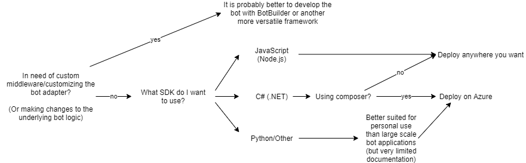

# Rostbotguide

    Document Status: Finished
    Inspected by: Filip Nyberg (Quality Coordinator) & Ola Friberg (Technical Writer) on 2020-12-09
    Contact Person: Albin Jonfelt (Integrator)
    Written by: Albin Jonfelt (Integrator), Erik Lundin (Deployment Manager)
    Manager:

# Table Of Content

[**1. Dependencies and installation**](#dependenciesandinstallation)  
&nbsp;&nbsp;[1.1 Quickstart](#botemulator)  
&nbsp;&nbsp;[1.2 .NET Core](#netcore)  
&nbsp;&nbsp;[1.3 Bot Emulator](#botemulator)  
&nbsp;&nbsp;[1.4 Bot Composer](#botcomposer)  
&nbsp;&nbsp;[1.5 Source code](#sourcecode)  
&nbsp;&nbsp;[1.6 Setting up the localhost](#settingupthelocalhost)  
&nbsp;&nbsp;[1.7 Running the bot](#runningthebot)  

[**2. Our implementation**](#ourimplementation)  
&nbsp;&nbsp;[2.1 Mindset](#mindset)  
&nbsp;&nbsp;[2.2 Reading and writing date](#readingandwritingdata)  
&nbsp;&nbsp;[2.3 OpenEHR](#openehr)  
&nbsp;&nbsp;[2.4 Side-track from original product](#sidetrackfromoriginalproduct)  

[**3. Customization**](#customization)  
&nbsp;&nbsp;[3.1 Using Composer](#usingcomposer)  
&nbsp;&nbsp;[3.1.1 Triggers](#triggers)  
&nbsp;&nbsp;[3.1.2 Input/Output](#inputoutput)  
&nbsp;&nbsp;[3.1.3 Dialogs](#dialogs)  
&nbsp;&nbsp;[3.2 Custom Actions](#customactions)  

[**4. Deployment Manager's Notebook**](#deploymentmanagersnotebook)  
&nbsp;&nbsp;[4.1 Brief Introduction](#briefintroduction)  
&nbsp;&nbsp;[4.2 Some notes regarding the framework](#somenotesregardingtheframework)  
&nbsp;&nbsp;[4.3 How is a Microsoft Bot Hosted?](#howisamicrosoftbothosted)  
&nbsp;&nbsp;[4.4 Our choices: Good and bad](#ourchoicesgoodandbad)  
&nbsp;&nbsp;[4.5 Summary & Discussion](#summarydiscussion)  

# 1. Dependencies and installation 

## 1.1 Quickstart 
1. Install .NET Core 3.1   
2. Install Bot Emulator   
3. Install Bot Composer (can be skipped if just viewing the bot)
4. Download source code
5. Place login.txt one folder "up" from the downloaded folder and use the password (which is not to be uploaded to Git)
6. Install Python, run "python3 -m venv venv" in deploy folder (troubleshooting and other platforms, use readme in backend folder)
7. Run "./venv/Scripts/activate (PowerShell)" or "source venv/bin/activate" (bash)
8. Run "pip install -r requirements.txt" in the same folder as above
9. Run "python resetDB.py" and "python run.py" in backend folder
10. Open Bot Composer, opening the folder "rostbot" as a bot (if skipped, run "dotnet run --project azurewebapp" in the runtime folder)
11. Go to settings, edit the runtime config to your local runtime folder in rostbot
12. Press Start Bot in the top right corner
13. Press "Test in emulator" to open Emulator, or copy the localhost-adress and paste it in emulator. 
14. Bot should now be running in emulator

## 1.2 .NET Core 
.NET core 3.1 can be installed here https://dotnet.microsoft.com/download/dotnet-core/3.1 

## 1.3 Bot Emulator 
To install the Bot Emulator, follow this link: 
- https://github.com/Microsoft/BotFramework-Emulator/blob/master/README.md

This is for emulating the bot on a local host, for a preview before deployment.  

## 1.4 Bot Composer  
To install the Bot Composer, follow this link: 
- https://docs.microsoft.com/en-us/composer/install-composer 

This is for editing functionality of the bot, and also where you can see how the flows are built. 

## 1.5 Source code 
You will also require a clone or fork from our repository, which can be found with the following link: 
- https://gitlab.liu.se/tddc88-company-1-2020/deploy

This contains all code of our bot, and is the main product. The branch to pull is "develop".

## 1.6 Setting up the localhost 
To ensure that the bot is run correctly, the readme file in the "backend" folder must be read and followed. This will start a virtual python environment and run a program which sets up the storage and retrieval of HTTP requests, and also the connection to OpenEHR. If this is not set up properly, the bot will present an error message at the start of the conversation, to inform you of it. If you have followed the instructions and the error still appears, make sure that you are "standing" in the correct folder when creating the venv and activating it, as well as when running the run.py. The steps for doing this is in short steps in the quickstart guide, but the readme will ensure that it is done correctly, and could also be used if running into problems. 

## 1.7 Running the bot   
The way which is probably going to be the most frequent way is to use Bot Composer by opening the "rostbot" 
and simply pressing "Start bot" in the top right corner. This will start a localhost, and is the same as running "dotnet run --project azurewebapp" in the runtime folder. You can either hover over "test in emulator" and copy the link to the localhost, or click it (have had some issues with this in ubuntu however, probably because the client is running as an AppImage). The custom runtime must also be changed in the settings to the path of the folder "runtime" on your local repository, as that path isn't version handled in Git. 

# 2. Our implementation 

## 2.1 Mindset 
We have built the bot with the thought in mind that we simply do not have enough knowledge about the medical field. This has
led us to trying to create a bot with a focus on being as easy to customize and use as possible. This document is also aimed towards
achieving the same goal. How this is reflected in the bot, is that we've tried to make inputs general by using variable names instead of hard-coding it with choices, which will anyway later on depend on your usage and the patients input.
This can be seen in multiple places, with answers like "Du kommer nu få svara på några frågor gällande din ${user.symptom}". User.symptom will contain the input of previous dialog.   

## 2.2 Reading and writing data 
Another thing we felt important was to not make mock-ups in the Bot Composer, but instead read and write from/to an external point. This can be seen with implementations like "HTTP Request GET: localhost/available-times". This is to ensure that it is possible to do these kinds of implementations, and also to give fixed points of where you as the customer is supposed to implement your own solutions for handling avaliable times, and data about the patient for presenting measurments to name a few.

## 2.3 OpenEHR 
We have also implemented OpenEHR, to keep track of user-id:s. As requested, the copy of the password to openEHR is not in GitLab, but instead handled locally on each of the developers machines by reading from one folder above the Git repository.    

## 2.4 Side-track from original product 
Along the way of developing the product, we found out that a booking system for phone times and consultation times would be a great addition to the product, as the main focus earlier was simply to get measurments. This is something we'll continue to expand on and try to implement the selections of when a patient is supposed to get phone care or a physical meeting. Furthermore, we'd like to open up for the possibility to use the questionares used in the Health Centres to unload the phone staff at the Health Centres.

# 3. Customization 

## 3.1 Using Composer 

### 3.1.1 Triggers 
When composer is up and running, you'll see an array of "Dialogs" on the left hand side. These can be thought of as "objects" in object oriented programming, with each containing it's own set of actions, triggers and variables. To use general triggers, which is supposed to be run from all parts of the bot, go to the dialog called "rostbot". Here you'll see triggers like "Cancel", "Consultation" etc. To make a new one, press the plus sign to the right of the left hand side column, and press "Add a new trigger".
This needs a name, and also a "Pattern". The pattern is the command that the trigger shall respond to, this can be enhanced whenever natural language processing for the swedish language is possible. In the trigger, you can add actions to start new dialogs, or present information, in the way you would when customizing the dialogs themselves. 

### 3.1.2 Input/Output 
To recieve user input, you can add an action intended to recieve different forms of data. This can be text, numbers, multi-choice etc. These options are available from the menu after pressing the plus sign inside a trigger or dialog.
To use this input, you need to set a variable to recieve the data, this can be found in the top of the right hand side after pressing the newly created action. To use this variable in text, you need to use ${scope.var_name}. More information about scopes can be found here: https://docs.microsoft.com/en-us/composer/concept-memory. The basics on it is that the scope "dialog" is referring to the dialog and its children dialogs, and can be used inside those. "Conversation" is during the entire scope of the conversation, and will reset with a new conversation-id. "User" is connected to the user-id, and will be saved across different conversations with the same user-id. "Turn" is very local, this can be used for confirmation messages, and falls out of scope and memory as soon as a new turn is begun, this could be asking a new question. "This" is linked to the used action, this could be asking a question about an input, and this.turnCount would yield the number of times a user has tried to input a value without success. This could be used to stop frustration for patients that doesn't seem to understand how the input is supposed to be given, by setting an intent trigger on a particular keyword that is set when "turnCount > 5", for example. This isn't something we've implemented so far. 

### 3.1.3 Dialogs 
Dialogs are one of the main features with using Bot Composer, which makes using actions relatively straightforward. When you create a new dialog, by pressing the plus to the right of the left side column, press "Add a new dialog". This will take you to a newly created dialog, after setting a name for it. Then use "On begin" to enable actions from when the dialog starts, the entry requirements can also be changed by pressing the dialog on the left side column. In the dialogs, you can use conditionals for responding to different inputs, save data to variables, and respond with different types of messages. You can use plain text with "Send a response", but with the same type of response, you can also create "cards", which we have examples of, the selection at the start of the conversation is one. The cards are specific to the dialog, and can't be used in other dialogs without copying the code for the card. When creating a new action, like a conditional, response, input, you can also find "Custom Actions", which we'll go over next. 

## 3.2 Custom Actions 
Custom Actions can be used in a similar way as any other actions, the difference being is that these can be more complex through writing them in C#. There is a separate readme-file for this that is located in the runtime folder, which is located inside the rostbot folder. To use these, read the steps given. You will also have some examples of implementations by using this. 

An important part here is that using custom actions require you to set the folder of the runtime to your local path, as described earlier in this document. A heads up when facing this error is that the bot will respond "object reference not set to an instance of an object". 

To quickly copy the path, navigate to the runtime folder in a terminal:
* Windows: echo %cd% | clip
* MacOS: pwd | pbcopy
* Linux: pwd (then copy the output manually).  

Paste this into runtime config in Composer settings:   
> Add "dotnet run --project azurewebapp" to start command.  
    
A quick guide for setting up custom actions is following:

1. Navigate to runtime/azurewebapp
1. Create a new .cs file in "customactions/actions" with the name of your custom action 
2. Create a new .schema file in "customactions/schemas" with the name of your custom action 
3. Copy the contents of any existing customaction into the .cs and .schema files 
4. Change the .schema to match the number of variables you wish to input and output by creating them as new objects, or removing them
5. Change the title, description and kind of the schema file to something descriptive 
6. Change the .cs file at classname and kind, and the variables to match the name of the variables in the schema file (not the titles)
7. Edit the code at the bottom of the .cs file, there's examples to be looked at on how to fetch the variables and return them
8. Navigate to the schema folder in rostbot 
9. Run "./update-schema.ps1" (PowerShell) "sh ./update-schema.sh" (bash) Note: have had issues with the bash script 
10. Open Composer, and add an action at desired place, and go to the bottom of the list of actions to find "Custom Actions"
11. Select your custom action 
12. Press the custom action and set variables to send in to the custom action. If using variables, the input needs to be in the format ${scope.var}, the output however, doesn't 
A more thorough guide is as mentioned located in the readme file in the runtime folder 

# 4. Deployment Manager's Notebook 

## 4.1 Brief Introduction 

The purpose of this chapter is to act as a documentation for all work related to the deployment of [rostbot](https://gitlab.liu.se/tddc88-company-1-2020/deploy), and to aid the reader in making decisions related to deploying a bot built with [Microsoft Bot Framework (MSB)](https://dev.botframework.com/). The chapter will describe the decisions that year 2020's Company 1 made related to deployment of the health care bot, as well as to provide a healthy discussion regarding these decisions and whether or not they were optimal for the task at hand.

## 4.2 Some notes regarding the framework 

Although there are several ways to build a bot with Microsoft Bot Framework (as mentioned in the [Architecture Notebook](https://gitlab.liu.se/tddc88-company-1-2020/company-documents/-/blob/master/Output/ArchitectureNotebook.md)), there are some common factors that all bots share. Microsoft has built the framework in such a way that it is tightly integrated with Microsoft Azure. This means that, although it is perfectly possible to deploy the bot on any server platform (AWS, Google Cloud, or your own servers), it is necessary to register the bot via the Microsoft Azure Portal. The reason for this is that despite the different SDKs that exist, they all share a common underlying structure. Specifically, they all implement the same HTTP Adapter. This Adapter is what handles the logic when the bot server receives chat requests from different *channels*.

The framework supports a wide range of Channels (applications):
- Facebook Messenger
- Kik
- Microsoft Teams
- Slack
- Many other chat applications
- And lastly, *Direct Line*

The channels are created simply by adding them on the page for the bot registration available in the Azure Portal. When a channel is created, Azure creates client secrets for each channel that are used to establish connections between clients and the actual bot. The details surrounding this aspect varies from channel to channel as different channels communicate in different ways.

Direct Line is the API to use when you want to let users communicate with the bot via your own custom client (e.g. a website). The client can establish connections to users via the [Bot Framework Direct Line API](https://docs.microsoft.com/en-us/azure/bot-service/rest-api/bot-framework-rest-direct-line-3-0-api-reference?view=azure-bot-service-4.0). 

The DirectLine API acts as a middlepoint between client and bot server:

When a client connects to the server that is hosting the bot, it needs to have an authentication token. This token is specific for one chat session, and can be received by sending a HTTP POST request to the Direct Line API. The API requires a Direct Line secret that is generated when registering a bot on the Azure Portal. Since this secret should not be accessible by the user, a middleware server should store the secret, make the POST request, and then send the token that is returned from Direct Line to the user client. This token is then used by the client to authenticate the HTTP requests that are made to the bot during the chatting.

## 4.3 How is a Microsoft Bot Hosted? 

As mentioned, the bot can be hosted anywhere, as long as it is registered via the Azure Portal. When registering the bot, the endpoint url that the bot is listening on has to be provided. In order for this endpoint to work with DirectLine and other channels, it has to be hosted on a domain with a valid SSL certificate. Otherwise, Direct Line Api will refuse to provide a client token when it receives a POST request. When registering the bot, a Microsoft App ID and Password will be created alongside it. The ID and Password has to be provided in the bot's runtime (there is an *Appsettings.JSON* file for this that is created when the bot project is created). Unless these credentials match between Azure and the hosted bot, it will not be able to communicate via the channels that have been registered on Azure.

## 4.4 Our choices: Good and bad 

Since we had a limited budget, our available choices of hosting platforms got narrowed down a bit. We hosted the bot on LIU:s own Kubernetes Cluster. After a lot of trial and error, it worked as intended, but it was not trivial to make it work. Microsoft has streamlined the process for people that use Azure only, and no other service. If the bot is both registered and hosted on Azure, it is possible to simply upload the code to Azure and it will handle the whole hosting for you. The process of deploying the bot using Azure is very well documented, so for any business looking for a quick hosting solution without any hassles, we recommend opting for Azure all-the-way. If you on the other hand for any reason need to use another solution, the path is much more obscure, and it is more difficult to deploy the bot. 

The best analogy I could come up with is that the framework SDK consists of one see-through box which is simple to understand. In this box, everything is fun and games and you only need to think about how you want your bot to reply to the client. This see-through box resides on top of a black box, which you'd rather not touch at all - and you will not have to if you host the bot on Azure, but otherwise, chances are that you need to actually modify some things inside the black box as well.

Another thing to note is that the deployment process varies depending on what SDK or Bot Development Tool you use. We initially used the Node.js SDK, which was fairly straightforward to use. Due to the limited timeframe, we switched from the JavaScript SDK to using the Bot Framework Composer. While this initially made the development process easier, it made it even harder to successfully deploy the bot on our Kubernetes Cluster. The Composer tool is based on the Bot Framework C# SDK, but adds a layer of JSON "Conversation Schemas" on top of it. Furthermore, a bot codebase that is built with composer is even easier to deploy on Azure, theoretically one does not even need to write a single line of code to build a bot by using Composer and Azure. But at the same time, using Composer made it even more difficult to host the bot on our own servers. 

## 4.5 Summary & Discussion 

To summarize, the easy path is to deploy the bot via Azure. This also assures that professional technical support can be accessed from Microsofts own Bot Framework and Azure Team. During our development phase, it became apparent that the Bot Framework project, although well established and popular among bot developers, is still relatively new and consists of a lot of branching projects. Poor decision making can lead to "side tracks", such as our choice to develop the bot with Composer and hosting it on LiU:s server platform. I would advise to choose between the following "setups" when developing a bot with Microsoft Bot Framework:

The BotBuilder framework is a project that is based on Microsoft's Bot Framework and removes some of the "Azure shackles" that are imposed upon those that choose to develop a bot with Microsoft Bot Framework. It also offers more versatility in terms of customizing the bot's behaviour on different channels, in contrast of MSB where the BotAdapter handles all channels under the hood, granted that the bot is properly set up with Azure's API:s. If what you are after is simplicity at the cost of some flexibility, Microsoft's Bot Framework used with Azure is the way to go. If you want more flexibility at the cost of simplicity, a more custom solution with a framework like BotBuilder might be more appropriate.
