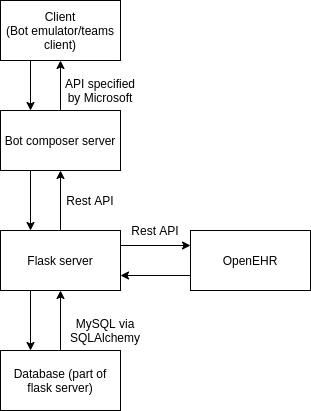
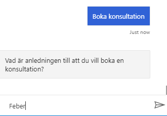
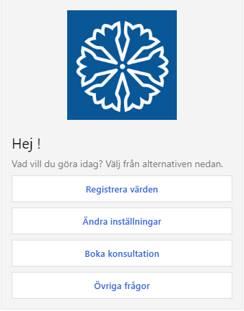

# **System Requirements Specification**

    Document Status: Finished 
    Inspected by Filip Nyberg (Quality Coordinator)
    Contact Person: William Bergekrans (Lead Analyst)
    Written by: Analyst team
    Manager: William Bergekrans (Lead Analyst)

## Log history:

| Date | Version number | Description | Changes made by |
| --- | --- | --- | --- |
| 2020-12-08 | 4.2 | Inspection performed. Final version. | Filip Nyberg |
| 2020-12-06 | 4.1 | Added images of UI and descriptive text | Tintin Andersson |
| 2020-12-03 | 4.0 | Fixed feedback from iteration 3 testing | William Bergekrans |
| 2020-12-01 | 3.6 | Updated titel 1.4 and cleaned up the tables | Agnes Öberg |
| 2020-11-30 | 3.5 | Added updated block diagram of system and some descriptions| Isak Almquist|
| 2020-11-29 | 3.4 | Updated sections 2.3, 1.1, 1,2 and reference table | Tintin Andersson |
| 2020-11-29 | 3.3 | Updated sections 2, 2.1, 2.4, and 2.5 | Alve Rybom |
| 2020-11-27 | 3.2 | Updated section 1.3 and 1.4 | Agnes Öberg |
| 2020-11-26 | 3.1 | Updated the prioritization of the requirements. | William Bergekrans |
| 2020-11-22 | 3.0 | Fixed feedback from testing workshop (the testing done during iteration 2) | William Bergekrans|
| 2020-11-18 | 2.8 | Updated requirements on Conversation Flow | Agnes Öberg |
| 2020-11-18 | 2.7 | Inspection performed | Filip Nyberg |
| 2020-11-17 | 2.6 | Added requirements for user verification | Tintin Andersson |
| 2020-11-17 | 2.5 | Finished requirements for Health Form | Agnes Öberg |
| 2020-11-16 | 2.4 | Wrote about focus on MS Teams | Alve Rybom |
| 2020-11-16 | 2.3 | Requirements for Health Control Flow | Agnes Öberg |
| 2020-11-16 | 2.2 | Requirements for symptoms check flow | William Bergekrans|
| 2020-11-14 | 2.1 | Clarified requirements, added surveys | Agnes, Alve |
| 2020-11-03 | 2.0 | More testable req. | William, Alve, Agnes, Tintin |
| 2020-10-13 | 1.3 | Added User stories | Agnes Öberg, Alve Rybom, Anton Johansson |
| 2020-10-08 | 1.2 | First draft of SRS | Agnes Öberg, Alve Rybom, Anton Johansson |
| 2020-09-29 | 1.1 | IEEE std structure | William Bergekrans |
| 2020-09-28 | 1.0 | Original version | William Bergekrans, Agnes Öberg |

## Table of contents

[**1. Introduction**](#introduction)  
&nbsp;&nbsp;[1.1 Purpose](#purpose)  
&nbsp;&nbsp;[1.2 Problem](#problem)  
&nbsp;&nbsp;[1.3 Solution](#solution)  
&nbsp;&nbsp;[1.4 How the problem is solved](#howsolved)  
&nbsp;&nbsp;&nbsp;&nbsp;[_1.4.1 Continuous measuring_](#continuousmeasuring)  
&nbsp;&nbsp;&nbsp;&nbsp;[_1.4.2 Trust and familiarity towards the system_](#trustandfamiliarity)  
&nbsp;&nbsp;&nbsp;&nbsp;[_1.4.3 Monitoring many users simultaneously_](#manysimultaneously)  

[**2. Overall Description**](#overalldescription)  
&nbsp;&nbsp;[2.1 Product Perspective](#productperspective)  
&nbsp;&nbsp;&nbsp;&nbsp;[_2.1.1 System Interfaces_](#systeminterfaces)  
&nbsp;&nbsp;&nbsp;&nbsp;[_2.1.2 User Interfaces_](#userinterfaces)   
&nbsp;&nbsp;[2.2 Product Functions](#productfunctions)  
&nbsp;&nbsp;[2.3 User characteristics](#usercharacteristics)  
&nbsp;&nbsp;&nbsp;&nbsp;[_2.3.1 Engaged &amp; Responsible_](#engagedresponsible)  
&nbsp;&nbsp;&nbsp;&nbsp;[_2.3.2 Technologically illiterate_](#technologicallyilliterate)  
&nbsp;&nbsp;&nbsp;&nbsp;[_2.3.3 Trusting_](#trusting)  
&nbsp;&nbsp;[2.4 Assumptions and dependencies](#assumptionsanddependencies)  
&nbsp;&nbsp;[2.5 Apportioning of requirements](#apportioningofrequirements)  

[**3. Requirements**](#requirements)  
&nbsp;&nbsp;[3.1 Conversation Flow](#conversationflow)  
&nbsp;&nbsp;[3.2 Register measurements](#registermeasurements)  
&nbsp;&nbsp;[3.3 Ask questions](#askquestions)  
&nbsp;&nbsp;[3.4 Manage booking of consultation](#managebookingofconsultation)  
&nbsp;&nbsp;[3.5 Manage notifications](#managenotifications)  
&nbsp;&nbsp;[3.6 Design and other](#designandother)  
&nbsp;&nbsp;[3.7 Health Form](#healthform)  
&nbsp;&nbsp;[3.8 User Verification](#userverification) 

[**4. References**](#references)

## 1. Introduction 

Home monitoring is a natural next step for healthcare services and is a trend within modern society. Global brands such as Apple brand their smartwatches as &quot;The future of health is on your wrist&quot; (Apple, 2020) which highlights peoples&#39; interest in getting involved with their own well-being.

Time, interest, and availability are examples of factors that can limit a person&#39;s ability to take required measurements. Trust is also a limiting factor; how can we get the patients to trust the system and get a feeling of familiarity. If the patients feel familiar with the app and feel that they have a personal contact with the home monitoring system, we believe this will positively impact the incitements to continuously measure themselves.

This document presents some of the problems the project team have identified with home monitoring and a solution to these. The solution will be described with the help of the most important user cases and functions that the application will deliver.

### 1.1 Purpose 

The purpose of this document is to describe the features and behavior of the solution we develop towards Region Östergötland&#39;s home monitoring system. For the initial part of the Region Östergötland&#39;s project there are 4 main areas of interest, COPD, heart failure, frail elderly and diabetes (Önskat läge, 2019). In order to address the main areas of interest as good as possible we will develop a service that will enable users of all age groups to perform simple health care tasks, such as booking appointments, ask for information or answer questionnaires from the comfort of their own home. The service will be streamlined, easy to use and places the user in focus. 

### 1.2 Problem 

In one study by Moser et. Al 34 percent of patients with heart failures took all their medication as prescribed and only 14 percent weighed themselves daily (Moser et. Al, 2005). Even though one may consider weighing and taking pills easy to do activities, this is clearly not the case. The processes may be too hard or the incitements to low, or a combination. It is therefore very important for a home monitoring system to assist the patients to measure themselves over a long period of time.

A study about mobile medication management apps and user perceptions was performed by Grindrod et Al. in 2014 and found that in adults aged 52-78 mobile health apps were useful if they could provide help when searching for information about healthcare, learning about their condition as well as setting reminders. The study also explored what barriers exists for users and found that usability issues, worries of making a mistake, wasting time and effort, lack of benefits from use as well as cognitive issues were highlighted by subjects. These problems are what we feel we need our system to be designed around. If we can work around these issues we can provide a positive experience for our user base and support them over an extended period of time.

Familiarity and trust towards the system is another challenge with home monitoring. As described in an article by LaRosa and Danks AI and robotics within healthcare face problems with building trust and needs to be implemented carefully to not damage patients trust of the healthcare system (LaRosa, Danks, 2018). LaRosa and Danks argue that medical licensing of the system, educated consent by the patient or caregiver prior to AI implementation and providing alternative methods of care before it is accepted as the standard are three important aspects to keep in mind when implementing AI and robotic services within healthcare.

We believe continuous measuring and trust of the application are two strongly connected problems. If the trust is low the risk of not measuring regularly is higher.

If the trust for our system is high and the patient use it effectively it can also address another problem with home monitoring which is how the caregivers can handle many patients simultaneously. The healthcare system can save a lot of resources by having a smart way of handling many patients or having a system that makes the amount of required human interactions less.

The three main problems that we have identified and that our solution aim to address are summarized as follows:

- Continuous measuring
- Monitoring many patients simultaneously
- Trust and familiarity towards the system

### 1.3 Solution 
The proposed solution is to develop and integrate a chatbot with an existing web application for a home monitoring system. The solution is seen as an additional platform apart from the current web application with the purpose to facilitate the general usage of the application. It can be seen as complementary functionality rather than replacing current functionality. 
Completely through this chatbot, the patients shall be able to perform the most vital parts of the home monitoring system like:

1. Register their measurements
2. Follow guides regarding their measurements
3. Book consultations
4. Check their symptoms
5. Answer health control forms regarding their general health (provided by the caregivers)
6. Ask questions
7. Receive notifications

The patients shall be able to register their measurements efficiently through the chat where the chatbot asks for each value required. If the patients need help during the measurement it shall also be able to receive guides explaining each step. The patient shall also be able book consultations with their caregivers if necessary where the severity of the symptoms are taken into consideration. The patient shall also be able to answer a health control form regarding their general health in order to see their progress made. Lastly, the patients shall also be able to ask questions and receive notifications when it is time to perform measurements or when it is time for a booked consultation.

Having the functionality presented above concentrated in the chat implies that the patients no longer need to navigate around on the web application - which makes this solution easier regarding navigability and understandability. Using a chatbot framework, it shall be possible for the patient to interact with the bot using different inputs and devices in order to perform all functionality. The patient should have a feeling of talking to the caregivers and therefore get a feeling of human interaction that copes with the lack of face-to-face contact home monitoring system otherwise provides. What is especially important for the solution to work properly is that it is easy for everyone to use and should be a solution that improves the patients’ overall experience. 

### 1.4 How the problem is solved 

This section describes how we believe our solution solves each of the problems identified in [1.2](#problem): Continuous measuring; Trust and familiarity towards the system; and Monitoring many users simultaneously.

#### 1.4.1 Continuous measuring 
We believe having a solution that improves the simplicity and understandability will improve the overall attitude towards the system and therefore improve the problem identified regarding continuous measuring. The largest contributor identified for continuous measuring is the amount of motivation possessed by the patients. If the system is easy and efficient to use, the patient's motivation along with the possibility of continuing using the system may be improved. 

The ambition with this solution is to improve the simplicity and understandability of the home monitoring system. This is mostly realized by concentrating the functionality in the chat so that the patients no longer need to navigate around in the web application. If the chatbot can help more users to understand, it will lead to an overall better attitude towards the system - which will increase the possibility that the patients will continue to use the system effectively, and therefore solve the problem identified regarding continuous measuring. 
Apart from helping the patient to use the web application the chatbot shall also send notifications which will be a good reminder for the patients when it is time to perform their measurements. This will help the patients to develop a good routine and therefore help them to continue their measurements.

#### 1.4.2 Trust and familiarity towards the system 
We believe the trust and familiarity towards the system will increase as the chatbot is intended to generate a more realistic experience of personal contact and a more trustworthy feeling of human interaction. Important for this solution is that the chatbot shall adapt each conversation to each patient in order to personalize the conversations and therefore improve the service quality and user experience. In addition to this, we believe the chatbot can improve the lack of face to face contact the home monitoring system provides today, which will hopefully have a positive impact on the trust and familiarity towards the system.

#### 1.4.3 Monitoring many users simultaneously 
We believe that the chatbot will have an impact on the number of questions asked by the users to the caregivers. More questions will probably be answered by the chatbot which will lead to less questions directed towards the caregivers. This would decrease the administrative burden for the caregivers that in turn can be spent in other more important activities – and therefore be able to handle more patients simultaneously as some get answers from the chatbot instead. 

Apart from answering questions from the patients, this solution also allows the patients to check their symptoms and clarify the severity of them. If the symptoms are considered bad enough, the patient will be able to book a consultation through the chat. This will decrease the amount of phone calls from patients that have questions about their symptoms, and therefore help the caregivers monitor more patients simultaneously. Lastly, the health control form is also a contributor for monitoring many since offering the forms in the chat is an efficient way for the patients to access them instead of sending them personally. The answers can then easily be stored for both caregivers and the patients to observe the progress made.

## 2. Overall Description 

This section describes general factors that affect the product and its requirements. It lists required functionality from dependencies, user characteristics, and describes the intended user’s methods to interact with the system. The section also describes assumptions that were made, as well as lists some reservations about the content in this document.

### 2.1 Product Perspective 

The chatbot is intended as a part of a larger home monitoring system. The chatbot is not intended to be the only way to register measurements and get support. Instead, it is supposed to be an easy-to-use alternative to a regular web interface. In a complete home monitoring web interface, the chat is intended as a &quot;bubble&quot; always present to the user. The user can interact with the chatbot to get questions answered and easily access key functions.

For key functionality to work the chatbot system need access to a few resources:

- To get patient data and store measurements it needs access to patient data. This is done in OpenEHR through another server to simplify the requests.
- In order to book meetings, the system needs an interface to the Region&#39;s booking system. This is simulated with a server which composer communicates with.

_Figure 1: Illustration of the system_

#### 2.1.1 System Interfaces 
The chat bot uses Microsoft’s bot framework, which is a framework to develop chat bots.  It’s been used successfully in healthcare contexts before, and the existing tutorials and documentation material are of high quality. This is promising for future development: new features can be available as open source, requiring little effort to implement.

A database will be required for storing, updating, and getting patient data. The system will have to be able to identify the patient it is interacting with to know which patient to look for in the database. Patient data stored in the database could be, among other things, name, personal number, medical conditions, and previous registered measurements. The system will also require access to the Region’s booking system to see what time slots are available, and to create or edit bookings. 

#### 2.1.2 User Interfaces 
Our product currently is accessible on two separate platforms: on Microsoft Teams and on a web application. The feature set is the same on both platforms, the only difference between them is the interface. The rationale for using Microsoft Teams is that it’s easy to integrate with the bot framework and supports a lot of the technologies the chat bot relies on natively. Because of this, more effort is required to implement some features on the web application.

In a Microsoft Teams interface, the user can navigate to the specific chat the user has with the chatbot. In this chat, the user can ask questions and use key functions of the chatbot. There are also several pre-written messages the user can choose from, for quick access to specific functions or answers to specific questions.

However, Teams is not very flexible, and the target group is unlikely to have used it before. Because of this, a web application is therefore also available. As it’s more customizable, the potential for this platform is limitless. In the future, this web app could be expanded into a complete home monitoring web interface.

The users of the system will, in many cases, be elderly. To optimize the system for these users, it will be developed to be easy-to-use. The technological threshold will be low. Messages from the chatbot will be easy to understand and help from the chatbot will be easy to access.

### 2.2 Product Functions 

The chatbot shall send messages when it is time to take the measurements, and by answering the chatbot it also shall be possible to register the measured results. It shall be able to assist the user during the self-measuring process and be able to discern if a measurement might be taken or reported incorrectly. The chatbot shall be able to provide answers to a set of FAQs. It shall be able to answer some questions written entirely by a user, and if it cannot answer it shall be able to send the user a link to, for example, 1177.se. The chatbot shall also be able to book a meeting when it is necessary for the patient to get in contact with a caregiver.

The current plan for the system is to support input via text and speech, as well as understanding a user&#39;s intent in plain text queries. However, this is subject to change due to restrictions and deadlines – see section [2.4](#assumptionsanddependencies) and [2.5](apportioningofrequirements).

### 2.3 User characteristics 

General characteristics for all users are that they suffer from chronic illness. They can suffer from a wide range of ailments, not limited to:

- Diabetes
- Heart Failure
- Chronic obstructive pulmonary disease (COPD)
- Visual impairments like cataracts

The users will most likely also be frail and elderly, over 65 and might have several ailments at the same time.

With these characteristics in mind, the chatbot's intended end users have been split into three main user groups. These groups are of different levels of technical knowledge, age and motivation. The groups are:

- Engaged &amp; Responsible
- Technologically illiterate
- Trusting

This means that our service will have to be able to take different measurements and users must be able to access questionnaires. Questionnaires are especially important since they are a key part of recovery and diagnosis of patients with a variety of diagnoses. These services must be easily accessible as well as simple to use and understand in order for our users to have an engaging experience. 

#### 2.3.1 Engaged &amp; Responsible 

This group of people want to be involved with their healthcare and want to feel that they are in control and understand the situation. This group is open to try new solution and often use other kinds of monitoring devices, such as smart watches. Their biggest fear with home monitoring is that it could give them less control over their sickness if implemented in a way where the patient has no insight. If implemented so that the user feel a sense of control, the option to pre-treat conditions and have direct communication with the healthcare system should be highly rated by this group.

_Figure 2: The user can book a consultation directly via the chat bot._

The chatbot aims to create an interactive environment to answer questions and guide the user in the most important tasks of home monitoring. For this group of users, the chatbot provides a communication link with the monitoring system and a platform for uploading measurements &quot;on the go&quot;.

#### 2.3.2 Technologically illiterate 

This group has very little faith in technology, either because they feel that learning something new is too demanding or that the value gained for the service is too low. Their biggest fears with home monitoring are that they must learn new skills and that it will result in a reduction of personal meetings, they place large value on social interactions with their heal care contacts. Home monitoring could potentially improve their contact with healthcare.

The chatbot has the strength that it can be implemented on many different platforms. The first release will use Microsoft Teams, but the company is also considering making the chat bot available on Messenger, which is Facebook&#39;s communication platform. According to our user research Facebook is the by far most popular platform among older people and therefore more likely to already be used by individuals in this group. The chatbot has the potential to make the transition to home monitoring easy and without requiring the use of new platforms such as navigating a new website.

To make this group approach home monitoring the solution needs to be accessible and easy to use. The chatbot should be developed with this in mind, it needs to help the user and it cannot depend on the user&#39;s knowledge of &quot;commands&quot;.

_Figure 3: By supplementing the user with short cut buttons, users wont have to memorize commands_

#### 2.3.3 Trusting 

The third group is a group that trusts and generally follows what instructions are given to them by health care personnel. A fear with home monitoring is that this group is given more responsibility, since they have to rely on themselves to perform accurate measurements. There is therefore even more emphasis on making the workflow with the bot as streamlined as possible. The gain is that the healthcare system has a constant insight into their patients’ health as well as both planned and acute visits may become less common as a result.
For technical solutions, this group trusts that the healthcare systems ensure that everything works and that instructions are easy to follow. It is therefore important that the chatbot is good at explaining what should be done and give clear and concise instructions. Notifications should also be important for this group as they do not believe it is their responsibility to remember when to take measurements.

### 2.4 Assumptions and dependencies 
This document and specifically the requirements in [section 3](#requirements) does not take specific aspects of the different interfaces that is used to implement the chat bot into account. However, this document is developed with the two platforms mentioned above (web application and Microsoft Teams) in mind. Therefore, offering the chat bot on another platform, such as on Facebook Messenger, will likely mandate updating the requirements listed below.

### 2.5 Apportioning of requirements 
As the project progresses and the limitations become clearer, features that won’t be developed because of the reasons mentioned above, or simply because they are out of scope will instead be listed in a separate document called [Future Development](https://teams.microsoft.com/l/file/B5978135-0A93-4967-B1C9-F6B5D05A983D?tenantId=913f18ec-7f26-4c5f-a816-784fe9a58edd&fileType=pdf&objectUrl=https%3A%2F%2Fliuonline.sharepoint.com%2Fsites%2FTeam_TDDC88_2020_C1%2FDelade%20dokument%2FGeneral%2FOutput%2FFutureDevelopment%2FFutureDevelopmentV2.0_FINAL.pdf&baseUrl=https%3A%2F%2Fliuonline.sharepoint.com%2Fsites%2FTeam_TDDC88_2020_C1&serviceName=teams&threadId=19:7ce88f3244084a0dbb213e331b1303e0@thread.tacv2&groupId=4cb19d20-9b2d-4ba5-b347-82fcae52b687) ([GitLab version here](https://gitlab.liu.se/tddc88-company-1-2020/company-documents/-/blob/master/Output/FutureDevelopment.md)). This list of expansions would make the service a more complete solution and can serve as inspiration for future developers.

## 3. Requirements 

This section contains all the software requirements for the chatbot. The requirements are divided into the different areas that the chatbot handles: Registering measurements; Asking questions; Manage booking of consultations; Managing notifications. It is also specified what the conversation flow shall be for the complete system and is considered as a seperate area. Other areas are: Design and others; Health Form; and User verification.

Each requirement is prioritized and listed by number. The priority system used for the requirements is the MoSCoW-Technique, which stands for the four different categories of initiative: 4 must-have, 3 should-have, 2 could-have, 1 would-have. Must-have requirements is seen as fundamental for the system to work while would-have requirements that is not that important for the system and does not necessarily need to be implemented.

### 3.1 Conversation Flow 
The user shall through the chat be able perform all functions required in the system. The chatbot shall generate a realistic experience and have a polite tone towards the user that improves the service quality. It shall be possible to communicate with the chatbot both by typing and clicking.

| **Functional Requirements** | --- | --- | --- | --- | --- |
| --- |---|---|---|---|---|
| **ID** | **Priority** | **Requirement** | **Author** | **Comment** | **Old ID** |
| 1.1 | 4 | When the user opens the chat the conversation flow 1.3 shall start | Agnes | |  |
| 1.2 | 2 | Everytime the user types &quot;Hej&quot; the conversation flow shall restart if the bot is inactive or the conversation flow has ended. | Agnes | If the chat, for example, already is open and wants the conversation to start | |
| **1.3 Conversation flow** | |  |  |The requirements under point 1.3 are specific to the conversation flow. | |
| 1.3.1 | 4 | When the user opens the chat the chatbot shall send a welcome message containing: &quot;Hej NAMN! Välkommen till Region Östergötlands chat-bot. Mitt namn är Number One Bot och jag finns här för att hjälpa dig&quot;. | Agnes | &quot;NAMN&quot; is the name of the user | 5.1 |
| 1.3.2 | 4 | The chatbot shall send a message to the user and ask what help is required: &quot;Vad kan jag hjälpa dig med?&quot; and suggest topics the user can get help with as buttons in the chat: &quot;Utföra mätning&quot;, &quot;Ändra inställningar&quot;, &quot;Boka konsultation&quot;, &quot;Fråga frågor&quot; | Agnes | | 5.1 |
| 1.3.4 | 4 | The user shall be able to choose what type of help needed from the suggested topics: &quot;Utföra mätning&quot;, &quot;Ändra inställningar&quot;, &quot;Boka konsultation&quot;, &quot;Fråga frågor&quot; | Agnes | | 5.2 |
| 1.3.4.1 | 4 | If the user clicks on button &quot;Utföra mätning&quot; the measurement registration flow shall start | Agnes | See 3.2 Register measurements and 2.3 measurement registration flow | 5.4 |
| 1.3.4.2 | 4 | If the user clicks on button &quot;Ändra inställningar&quot; the user shall be sent to the settings page | Agnes | See 3.5 Manage notifications settings | 5.4 |
| 1.3.4.3 | 4 | If the user clicks on button &quot;Boka konsultation&quot; the booking flow shall start | Agnes | See 3.4 Manage Book consultation | 5.4 |
| 1.3.4.4 | 4 | If the user clicks on button &quot;Fråga frågor&quot; the question flow shall start | Agnes | See 3.3 Ask questions | 5.4 |
| 1.3.4.5 | 4 | If the user types &quot;Utföra mätning&quot; the measurement registration flow shall start | Agnes |  | 5.5 |
| 1.3.4.6 | 4 | If the user types &quot;Boka konsultation&quot; the booking flow shall start | Agnes |  | 5.5 |
| 1.3.4.7 | 4 | If the user types &quot;Ändra inställningar&quot; the user shall be sent to the settings page | Agnes |  | 5.5 |
| 1.3.4.8 | 4 | If the user types &quot;Fråga frågor&quot; the ask question flow shall start | Agnes | | 5.5 |
| 1.3.5 | 4 | When a topic/flow is ended, and the user has received the required help, the chatbot shall ask if the user needs more help by typing: &quot;Kan jag hjälpa dig med något mer?&quot; | Agnes |  | 5.3 |
| 1.3.6 | 4 | The chatbot shall generate the alternatives &quot;Ja&quot; and &quot;Nej&quot; as buttons. | Agnes |  | 5.3 |
| 1.3.6.1 | 4 | If the user clicks &quot;Ja&quot; the chatbot shall ask &quot;Vad kan jag hjälpa dig med?&quot; along with the suggested topics as buttons. | Agnes | See suggested topics at 1.3.2 | 5.3 |
| 1.3.6.2 | 4 | If the user types &quot;Ja&quot; the chatbot shall ask &quot;Vad kan jag hjälpa dig med?&quot; along with the suggested topics as buttons. | Agnes | See suggested topics at 1.3.3 | 5.3 |
| 1.3.6.3 | 4 | If the user clicks &quot;Nej&quot; the chatbot shall answer &quot;Då tackar jag för mig. Ha en trevlig dag!&quot; and the chatbot shall become quiet. | Agnes | (Can be activated again by requirement 1.1 and 1.2) | 5.3 |
| 1.3.6.4 | 4 | If the user types &quot;Nej&quot; the chatbot shall type &quot;Då tackar jag för mig. Ha en trevlig dag!&quot; and the chat shall become quiet. | Agnes | (Can be activated again by requirement 1.1 and 1.2) | 5.3 |
| 1.3.7 | 2 | If the chatbot cannot answer the user&#39;s questions, the chatbot shall be able to send related links to the user that sends the user to another page. | Agnes |  | 5.7 |
| 1.3.8 | 1 | Before the chatbot respond a &quot;chatbot is writing&quot;-bubble shall appear. | Agnes | Can be in the form of a bubble (no text). | 5.8 |
| 1.3.11 | 2 | If the user types wrong input so that the chatbot do not understand, the chatbot shall answer &quot;Jag förstod inte, prova skriva igen.&quot; | Agnes |||
| 1.3.11.1 | 2 | If the user types the same wrong input again so that the chatbot still do not understand, the chatbot shall answer &quot;Jag förstår inte, prova skriva något annat så kanske jag kan hjälpa dig med det!&quot; | Agnes | | |
| **Non-Functional requirements** |  |  |  |  |  |
| **ID** | **Priority** | **Requirement** | **Author** | **Comment** | **Old ID** |
| 1.3.8.1 | 1 | The &quot;chatbot is writing&quot;-bubble shall be visible for 2s before the respond is sent to the user. | Agnes | Can be in the form of a bubble (no text). | 5.8 |
| 1.3.9 | 3 | The welcome message shall contain the chat bot&#39;s name and an introduction its functionality | Agnes|  | 5.1.1 |
| 1.3.10 | 3 | The welcome message shall contain the user&#39;s name in order to personalize the message | Agnes |  | 5.1.2 |
| 1.4 | 1 | When the user write &quot;Hjälp&quot; the bot shall write &quot;Jag är Region Östergötlands Chattbot! Av mig kan du få hjälp att registrera mätvärden, sätta notifikationer för mätningar och boka tid för konsultation. Du kan antingen använda knapparna i början av konversationen, eller så kan du skriva det du vill göra, t.ex. &quot;Registrera värden&quot; eller &quot;Ändra inställningar&quot;. &quot;| William | | 2.2.2.2 | 

### 3.2 Register measurements 

The user shall be able to register measurements through the chat bot. The chatbot shall be able to guide the user through the measurement process and recognize values that might be incorrectly measured or reported.

| **2.1 Measurement registering flow** ||| |  |  |
|---|---|---|---|---|---|
| **ID** | **Priority** | **Requirement** | **Author** | **Comment** | **Old ID** |
| 2.1.1 | 4 | When the measurement registering flow is started, the chat bot shall display a list of measurements that the user can register, including the Health Control Form. | Alve | A measurement can be weight, blood pressure, etc. | 1.2 |
| 2.1.1.1 | 4 | The user shall be able to click on a measurement in the list to start that measurement procedure. | Alve | 1.2.1 |
| 2.1.1.2 | 1 | User input &quot;Jag vill registrera min/mitt [[measurement]]&quot; shall start that measurement procedure | Alve | Example inputs: &quot;Jag vill registrera mitt blodvärde&quot;, &quot;Jag vill registrera min puls&quot;. Other inputs like &quot;min puls&quot; or just &quot;puls&quot; should also work. | 1.2.1 |
| 2.1.1.3 | 2 | The list shall be generated from the patient&#39;s schedule. | Alve | 1.2 |
| 2.1.1.4 | 1 | The list shall not contain measurements that are late by more than one week. | Alve | 1.2.2 |
| 2.1.1.5 | 3 | The list shall not contain more than one of each measurement. | Alve | For example, &quot;register weight&quot; shall not be shown two times. |  |
| 2.1.1.6 | 3 | If no measurements are available, bot shall output &quot;Du har gjort alla dina mätningar för stunden&quot;, and then end the flow. | Alve ||  |
| 2.1.2 | 4 | The chat bot shall ask &quot;Vad är din/ditt [[measurement]]?&quot; when the measurement procedure starts. | Alve | Ex &quot;Vad är din puls?&quot; or &quot;Vad är ditt blodvärde?&quot; | 1.1 |
| 2.1.2.1 | 4 | The chat bot shall be able to test blood pressure |Alve| Specific example for testing purposes. ||
| 2.1.3 | 4 | User shall be able to input a measurement value when the bot asks for it. | Alve | Should accept inputs like &quot;mitt värde är 70&quot;, &quot;min vikt är 65 kg&quot; or just &quot;60&quot;. | 1.1 |
| 2.1.3.1 | 2 | The chatbot shall be able to handle multiple values at once. | Alve | Some medicinal measurements are related to each other (for example blood pressure is systolic and diastolic (över-/undertryck)) | |
| 2.1.3.2 | 1 | The chatbot shall only accept integer as input values. | William | | 1.7.1 |
| 2.1.3.3 | 1 | If the registered blood preasure is lower than the interval 100-140/60-90 mmHg the bot shall ask the user &quot;Ditt blodtryck är väldigt lågt, är du säker på att du skrivit in rätt värden?&quot; | William | | | 
| 2.1.3.4 | 1 | If the registered blood preasure is higher than the interval 140-160/ 90-100 mmHg the bot shall write &quot; Ditt blodtryck är högt, är du säker på att du skrivit in rätt värde?&quot; | William | | |
| 2.1.4 | 4 | The chatbot shall double check the value: &quot;Är din/ditt [[measurement]] [[Value]]?&quot; | Alve | Ex &quot;Är din puls 74 bpm?&quot; or &quot;Är ditt blodtryck 120 över 80 mmHg?&quot; | 1.1 |
| 2.1.5 | 4 | The user shall be able to input a response to confirm/deny that the interpreted value is correct | Alve | | 1.1 |
| 2.1.5.1 | 4 | If user inputs &quot;ja&quot; (written), the bot shall save the value to the database. | Alve | | 1.1 |
| 2.1.5.2 | 1 | User input &quot;Ja, värdet stämmer&quot; (clicked) shall result in the bot saving the value to the database. | Alve | | 1.1 |
| 2.1.5.3 | 4 | If user inputs &quot;nej&quot; (written), the bot shall ask for the value again. | Alve | | 1.1 |
| 2.1.5.4 | 1 | User input &quot;Nej, värdet stammer inte&quot; (clicked) shall result in the bot asking for the value again. | Alve | | 1.1 |
| 2.1.6 | 3 | When all values are saved, the bot shall write &quot;Bra jobbat! Tack för att du registrerade dagens mätning av ditt blodtryck. Du är nu klar med mätningen, dina värden är sparade.&quot; | William | | 2.1.7 |
| 2.1.6.1 | 2 | The alternative &quot;Avsluta mätning&quot; shall be presented to the user. | William | |
| 2.1.7 | 2 | When the user clicks &quot;Avsluta mätning&quot; the bot shall write &quot;Härligt! Alla dina mätningar för dagen är nu registrerade! Din nästa mätning är på onsdag den 14/10. &quot;  | William | | |
| 2.1.7.1 | 2 | The bot shall present the alternatives &quot;Återgå till start&quot; and &quot;Registrera ytterligare mätvärden&quot;. | William | | | 
| 2.1.8 | 3 | If the user click &quot;Registrera ytterligare mätvärden&quot; the bot shall write &quot;Vilket värde vill du registrera?&quot; | William | | | 
| 2.1.8.1 | 3 | The bot shall present the alternatives &quot;Blodtryck&quot;, &quot;Placeholder&quot;, &quot;Placeholder&quot;. | William | | |
| 2.1.9 | 3 | If the user click &quot;Återgå till start&quot; the bot shall write &quot;Vad vill du göra nu? Välj från alternativen nedan.&quot; | William | | | 
| 2.1.9.1 | 3 | The bot shall present the alternatives &quot;Registrera värden&quot;, &quot;Ändra inställningar&quot;, &quot;Boka konsultation&quot; and &quot;Övriga frågor&quot;. | William | | | 

| **2.2 Guides** | | | | | |
| --- | --- | --- | --- | --- | --- |
| **ID** | **Priority** | **Requirement** | **Author** | **Comment** | **Old ID** |
| 2.2.1 | 3 | Each step of the measuring process shall have an accompanying guide. | Alve | | 1.3 |
| 2.2.2 | 3 | The first time the user registers a measurement the bot shall write &quot;Vill du se guidning?&quot; | William | If the current implementation is not exactly like the requirement it probabily is alright. | 1.3 |
| 2.2.2.1 | 2 | If the user write &quot;Se guide&quot; the guide for the measurement shall be started. | William | | 1.3.2 | 
| 2.2.2.2 | 2 | The alternatives &quot;Ja&quot; and &quot;Nej&quot; shall be displayed. | William | | | 
| 2.2.2.2.1 | 1 | The user's answer shall be saved for future reference | William | | | 
| 2.2.3 | 2 | The guide shall contain a descriptive text and an image for each step. | Alve | | 1.3.3 |
| **Non-Functional Requirements** | | | | | |
| **ID** | **Priority** | **Requirement** | **Author** | **Comment** | **Old ID** |
| 2.2.4 | 3 | The guide shall look like a message from the chat bot. | Alve | |2.2.3|

### 3.3 Ask questions 

The user shall be able to ask the chatbot questions, both pre-written and self-written. These requirements tell how the user shall be able to ask questions, and how the chatbot shall respond.

| **Functional Requirements** | | | | | |
| --- | --- | ---|---|---|---|
| **ID** | **Priority** | **Requirement** | **Author** | **Comments** | **Old ID** |
| **3.1 Question Flow** | | | | | |
| 3.1.1 | 4 | When the question flow is entered the bot shall write &quot;Vad undrar du?&quot; in the chat. | William | | |
| 3.1.2 | 4 | When the question flow is entered the bot shall show 4 questions as clickable alternatives to the user. | William | These questions shall be individual for the user, related to the specific measurements, etc. For example, when a measurement is to be taken (time of day, just before/after meal etc) or what activities are good for staying active | |
| 3.1.3 | 1 | User input starting with &quot;Hur&quot;, &quot;Vad&quot;, &quot;Ska&quot;, &quot;När&quot;, shall be understod by the bot as question. | William | In a way this should work at any time without interupting another flow. | |
| 3.1.4 | 2 | The bot shall search for answers to questions in an FAQ database. | William | | |
| 3.1.5 | 2 | The bot shall return an answer if found or &quot;Jag kan tyvärr inte svara på den frågan.&quot;. | William | | |
| 3.1.5.1 | 1 | If the bot return &quot;Jag kan tyvärr inte svara på den frågan&quot; it shall search on 1177.se and send a link to the 1177 self-help page. | William | Hmm, not a perfect requirement right now. What is good enough??? | |
| 3.1.5.2 | 1 | After sending the 1177 link, the bot shall encourage calling 1177 if the patient couldn&#39;t find an answer to their question | Alve | | |
| 3.1.6 | 3 | When an answer is given the bot shall ask the user &quot;Är det något mer du vill fråga mig?&quot;. | William | Shall also provide yes/ no (Ja/nej) alternatives as standard. | |
| 3.2 | 3 | Written questions must be saved by the bot. | William | The purpose of this is to save questions in a database that the bot was unable to answer, this allows administrator to update answers to these and potentially reach out with an answer. | |
| 3.3 | 3 | The chat bot shall be able to tell the user when their next measurement is due. | Alve | Uses schedule in requirement 7.1.1.2.2 | 1.5.1 |
| 3.3.1 | 3 | User shall be able to ask &quot;När är nästa mätning&quot; to trigger the bot response. | Alve | | 1.5.1 |
| 3.3.2 | 3 | Bot output is {&quot;Nästa mätning är&quot; + MEASUREMENTTYPE + &quot;den&quot; + DATE} | Alve | For example &quot;Nästa mätning är puls den 2020-12-01 | 1.5.1 |
| 3.4 | 2 | The chat bot shall be able to tell the user how their measurement schedule looks like | Alve | Uses schedule in requirement 7.1.1.2.2 | 1.5.2 |
| 3.4.1 | 2 | User shall be able to ask &quot;Vad är mitt schema för mätningar?&quot; to trigger the bot response | Alve | | 1.5.2 |
| 3.4.2 | 2 | Bot output is a list of measurements and when they are taken. | Alve | For example &quot;Du ska mäta: Blodtryck varje måndag, onsdag, lördag kl 14. Puls varje torsdag när du vaknar. Etc.&quot; iCal link/visual display better if it&#39;s possible to implement. | 1.5.2 |
| **Non-functional Requirements** | | | | | |
| 3.2.1 | 1 | The questions shall be saved in a way that allows building a system for admins to view and answer questions | | For future use (supporting req 6.1.1.x) Storing as a .txt file is enough for now. | |
| 3.5 | 2 | The questions shown to the user shall take into account the user&#39;s measurements, results, bookings. | William | Personalized questions to enable the example questions in 3.1.2 | |

### 3.4 Manage booking of consultation 

Requirements for the booking flow. This flow should be executed when the user wishes to book a meeting with healthcare professionals.

| **Functional Requirements** | | | | | |
| --- | --- | ---|---|---|---|
| **ID** | **Priority** | **Requirement** | **Author** | **Comments** | **Old ID** |
| **4.1 Booking Flow** |  | | | The requirements under point 3 are specific to the booking flow. | |
| 4.1.1 | 4 | When the booking flow is activated the system shall send &quot;Vilken dag vill du boka vårdbesöket på?&quot; to the user. | William | As of now we assume that the only meetings to book are physical ones at the hospital. | |
| 4.1.1.1 | 2 | The user shall be able to enter {&quot;nästa&quot; + DAY} and the bot shall know what day it is. | William | An ideal bot should understand a wide array of inputs. We are satisfied with two strict formats now. | |
| 4.1.1.2 | 3 | The user shall be able to enter {INTDATE + MONTH} and the bot shall assume that the first upcoming date is meant. | William | INTDATE is a integer. MONTH is string. Ex: 10 Oktober, 21 november. | |
| 4.1.2 | 4 | The chatbot must show the interpreted date to the user on the format &quot;Är YY/MM/DD rätt datum?&quot;. | William | | |
| 4.1.2.1 | 3 | The chatbot must give the user the alternative &quot;ja&quot; and &quot;nej&quot; as buttons when showing the interpreted date. | William | | |
| 4.1.2.2 | 4 | User input &quot;ja&quot; (written) shall make the bot show available times on the requested day. | William | | |
| 4.1.2.3 | 4 | User input &quot;nej&quot; (written) shall make the bot ask for a new date on the format &quot;YY/MM/DD&quot;. | William | | |
| 4.1.2.4 | 4 | Clicked alternative &quot;ja&quot; shall make the bot show available times on the requested day. | William | If there are too many to show in a good way we should maybe only show some. Or ask what time is preferred? | |
| 4.1.2.5 | 4 | Clicked alternative &quot;nej&quot; shall make the bot ask for a new date on the format &quot;YY/MM/DD&quot;. | William | | |
| 4.1.3 | 2 | If there are no free times on the requested day the system shall show 3 times that are closest to the requested date as buttons on the format &quot;YY/MM/DD kl HH:MM-HH:MM&quot;. | William | For example, 20/11/14 kl 12:15-13:00 | |
| 4.1.3.1 | 2 | If none of the showed times are available for the user, the system shall show next 3 times that are closest to the requested date. | Agnes | | |
| 4.1.4 | 3 | If the user clicks on a suggested date, the chatbot shall reserve that time slot in the booking system. | William | | |
| 4.1.5 | 3 | The bot shall respond after a time slot is chosen with: &quot;Du har valt att boka en tid klockan HH:MM-HH:MM den INTDAY MONTH på VÅRDCENTRAL med läkare NAMN. Bokningen är nu registrerad. Var vänlig att svara på några frågor för att göra mötet smidigare. Varför bokade du detta möte?&quot; | William | INTDAY is the date of a day (integer). HH:MM-HH:MM is a time (start time to end time), hour and minute, EX 12:15-13:00. | |
| 4.1.5.1 | 3 | The user shall be able to give free text answer that the bot store in the meeting notes. | William | | |
| 4.1.6 | 2 | When the reason for the booking is saved the bot shall respond with &quot;Tack för ditt svar.&quot;. | William | | |

The following requirements are outside the booking flow. The following two features are covered:

- The user shall be able to view current bookings.
- The user shall be able to cancel previously made bookings.

| Functional requirements |||||
| --- | --- | --- | --- | --- |
| **ID** | **Priority** | **Requirement** | **Author** | **Comments** |
| 4.2 | 4 | On the user input &quot;Visa mina bokningar&quot; the bot shall reply with a list of all the user&#39;s current bookings. | William | |
| 4.2.1 | 3 | The bookings must have a visible induvidual ID. | William | |
| 4.3 | 3 | On the user input &quot;Avboka möte X&quot; the bot shall reply with &quot;Är du säker på att du vill avboka tiden X den INTDAY MONTH, klockan HH:MM?&quot;. | William | INDAY is a day as an integer. X is the ID of the meeting the user wishes to unbook. |
| 4.3.1 | 3 | The alternatives &quot;Ja&quot; och &quot;Nej&quot; shall be shown to the user as buttons. | William | |
| 4.3.2 | 3 | By clicking &quot;Ja&quot; the bot cancels the booking. | William | |
| 4.3.3 | 3 | After the booking is canceled the bot writes to the user &quot;Bokningen den INTDAY MONTH är nu avbokad, vill du boka en annan tid?&quot; | William | INTDAY is a day as a integer. Ex 1, 11, 22 |
| 4.3.4 | 3 | The alternatives &quot;Ja&quot; och &quot;Nej&quot; shall be shown to the user as buttons. | Agnes | |
| 4.3.5 | 3 | If the user clicks &quot;Ja&quot; the booking flow is started. | William | |

The following requirements deal with the feature of automating what kind of meeting the patient needs depending on the condition of the person. It is a couple of questions asking the patient to describe and choose symptons. The functional requirements only lay of the complete functions in regards to the symptom &quot;Yrsel&quot;. However, the program needs to be written in such a way that it is easy to add complete functionality for all symptoms. 

| **Functional Requirements** | | | | | |
| --- | --- | ---|---|---|---|
| **ID** | **Priority** | **Requirement** | **Author** | **Comments** | **Old ID** |
| **4.4 Symptons check flow** ||||||
| 4.4.1 | 4 | If the patients identity is unknown the bot shall ask &quot;Hur gammal är du?&quot;.|William | In order to give different options later on depending on the persons age. For example if the person would use the chatbot on Microsoft Teams the patient has to be logged in, and the age should therefore already be known. ||
| 4.4.2 | 3 | The bot shall write &quot;Vad har du för sympton?&quot;. | William |||
| 4.4.2.1 | 3 | The bot shall present the clickable alternatives &quot;Hosta&quot;, &quot;Ont i nacken&quot;, &quot;Yrsel&quot; and &quot;Öronbesvär&quot;. | William | | |
| 4.4.3 | 3 |When the alternative &quot;Yrsel&quot; is clicked the bot shall write &quot;Välj den beskrivning som passar bäst&quot;. | William | | |
| 4.4.3.1 | 3 | The bot shall present the clickable alternatives &quot;Svår yrsel eller yrsel i flera dagar&quot;, &quot;Tillfällig yrsel&quot;. | William | | |
| 4.4.4 | 3 | When the alternative &quot;Svår yrsel eller yrsel i flera dagar&quot; is clicked the bot shall write &quot;Du borde kontaka en vårdcentral, vill du att vi hjälper dig boka en tid?&quot;. | William | | |
| 4.4.4.1 | 3 | The clickable alternatives &quot;Ja&quot; and &quot;Nej&quot; shall be shown. | William | | | 
| 4.4.4.2 | 3 | When &quot;Ja&quot; is clicked the booking flow starts. | William | The booking flow described in 4.1 | | 
| 4.4.4.3 | 3 | When &quot;Nej&quot; is clicked the user is directed back to start. | William | | | 
| 4.4.5 | 3 |When the alternative &quot;Tillfällig yrsel&quot; is clicked the bot shall write &quot;Egenvård, gå in på följande sidor för mer information om vad du kan göra själv. Information om yrsel: https://www.1177.se/Ostergotland/sjukdomar--besvar/hjarna-och-nerver/yrsel-svimning-och-kramper/yrsel/ ,har du några andra symptom?&quot;. | William | Look into how we can send links, would be nice if we can send several "disguised" as a word.| | 
| 4.4.5.1 | 3 | The clickable alternatives &quot;Ja&quot; and &quot;Nej&quot; shall be show to the user. | William | | 
| 4.4.5.2 | 3 | When &quot;Ja&quot; is clicked the symptons check flow shall restart. | William | From req. 4.4 | | 
| 4.4.5.3 | 3 | When &quot;Nej&quot; is clicked the bot goes to the start mode. | William | | | 
| **Non-functional requirements** | | | | | |
| 4.5 | 4 | The list of symptons must be loaded from an external source. | William | In the schope of this project this can be e.g. a text-file. | |
| 4.5.1 | 2 | The list of symptons shall have the user's age as a parameter | William | | | 
| 4.6 | 4 | The list of sympton descriptions must be leaded from an external source | William || |
| 4.7 | 1 | The user shall be able to provide several symptoms in an free-text answer. | William ||| 
| 4.8 | 1 | The bot shall understand inputs in written text. | William | Not a foucur right now, but if the user write &quot;Yrsel&quot; it would be good if the bot can understand it. | | 
| 4.9 | 1 | When links are pressed the bot shall ask if the user really want to leave. | William | Probably as a popup? | | 

### 3.5 Manage notifications 

A user shall be able to change their settings for notifications. These requirements handle how a user can choose their settings for notifications.

| **Functional Requirements** | | | | | |
| --- | --- |---|---|---|---|
| **ID** | **Priority** | **Requirement** | **Author** | **Comments** | **Old ID** |
| 5.1 | 4 | The user shall receive a notification according to their settings in the settings page when it is time to perform a measurement | Alve | | |
| 5.1.1 | 4 | The notification shall display the time and type of measurement when it&#39;s due | Alve | Ex. &quot;Din puls ska mätas klockan 12:00&quot; | |
| 5.2 | 4 | The user shall receive a notification according to their settings in their settings page when it is time for a booked consultation | Agnes | Ex. &quot;Du har en telefontid med sjuksköterska Namn Namnsson kl 14:00&quot; | |
| 5.2.1 | 3 | The notification for the consultation shall display what time the consultation is booked | Agnes | | |
| 5.2.2 | 2 | The notification for the consultation shall display the name of the care giver that is | Agnes | | |
| 5.3 | 2 | When a user clicks on the received notification the user shall be sent to the related interface/flow. | Agnes | I.e. if the notification is for a specific measurement, that specific flow shall start. | |
| 5.4 | 1 | The user shall be able to snooze the received notification according to their settings in the settings page for a set amount of time. | Agnes | | |
| 5.4.1 | 3 | When a notification is snoozed, it goes away. After the set amount of time, it gets sent to the user again. | Alve | | |
| **5.5 Add notification flow** | | | | | |
| 5.5.1 | 4 | When the setting page is opened the system shall display a list of current notifications. | William | e.g &quot;Notis vid nytt meddelande&quot; | 6.2 |
| 5.5.2 | 3 | When the user clicks on the button &quot;Ny notifikation&quot; a create new notification window shall be displayed. | William | | 6.2.4 |
| 5.5.2.1 | 3 | When creating a new notification, the user shall be able to choose from a list what activity the notification is for. | William | See list of activities in 5.1.2.2 | 6.2.4.1 |
| 5.5.2.2 | 3 | The list of activities shall contain current measurements for that user and consultation. | Agnes | | |
| 5.5.2.3 | 1 | When creating a new notification, the user shall be able to set a chosen snooze time for that specific notification. | Agnes | | |
| 5.5.2.4 | 3 | The user shall specify at what time the notification will be sent out by choosing from the options: &quot;10 min innan&quot;, &quot;30 min innan&quot; and &quot;1 timme innan&quot;.  | William | | 6.2.4.2 |
| 5.6 | 4 | When the user clicks &quot;Radera notifikation&quot; the notification shall be deleted. | William | | 5.6.2 |
| **Non-functional**  **Requirements** | | | | | |
| **ID** | **Priority** | **Requirement** | **Author** | **Comment** | **Old ID** |
| 5.7 | 3 | The notification shall be a push notification | Alve | Pull notifications also exist; they are not a good fit for this project. | |

### 3.6 Design and other 

The system shall be built with maintainability in mind, so future versions can support more diseases and languages. The interface shall be designed so it&#39;s accessible and easy to use for as many as possible.

| **6.1 Chatbot configuration** | | | | | |
| --- | --- | --- |---|---|---|
| **Functional Requirements** | | | | | |
| **ID** | **Priority** | **Requirement** | **Author** | **Comment** | **Old ID** |
| 6.1 | 1 | The healthcare team shall have access to an interface for configuring the chat bot. | Alve | | 1.2 |
| 6.1.1 | 1 | The interface shall have a pane for configuring the chat bot&#39;s general settings. | Alve | | |
| 6.1.1.1 | 1 | The healthcare team shall be able to edit the questions and answers in the FAQ | Alve | | |
| 6.1.1.2 | 1 | The healthcare teams shall be able to view questions that the bot couldn&#39;t answer. | Alve | Complementing requirement 3.2 | - |
| 6.1.2 | 1 | The interface shall have a settings pane for each user of the chat bot | Alve | | |
| 6.1.2.1 | 1 | The health care team shall be able to configure which measurements the user can register. | Alve | | |
| 6.1.2.2 | 1 | The health care team shall be able to edit the user&#39;s measurement schedule. | Alve | Complementing requirement 2.1.1.3 | - |
| 6.1.2.3 | 1 | The health care team shall be able to define what an irregular value is for each user and measurement | Alve | Complementing requirement 2.1.3.2 | - |
| **Non-functional Requirements** |
| **ID** | **Priority** | **Requirement** | **Author** | **Comments** | **Old ID** |
| 6.1.2.4 | 1 | The chatbot&#39;s configuration interface shall use Material Design | Alve | | 7.1 |

| **Non-functional Requirements** | | | | | |
| --- |---|---|---|---|---|
| **ID** | **Priority** | **Requirement** | **Author** | **Comments** | **Old ID** |
| 6.2 | 4 | The client shall comply with Web Content Accessibility Guidelines 2.1 level AAA | Alve | &quot;All [functionality](https://www.w3.org/TR/WCAG21/#dfn-functionality) of the content is operable through a [keyboard interface](https://www.w3.org/TR/WCAG21/#dfn-keyboard-interface) without requiring specific timings for individual keystrokes.&quot;https://www.w3.org/TR/WCAG21/#keyboard-accessible | |
| 6.3 | 3 | The client&#39;s layout shall not break when using the browser&#39;s built in zoom function (Ctrl +) | Alve | Breaking is defined as overlapping elements, text outside of their boundaries, etc | |
| 6.4 | 3 | The system shall be built with modules | Alve | To enable adding additional modules(functionalities) with ease | |
| 6.4.1 | 3 | Symptoms, conditions, measurement procedures, and measurement values shall be modular | Alve | To make the adding of more of these easier. | |
| 6.4.2 | 1 | The system shall support language modules | Alve | The text output should be modular to enable adding more languages easier. | |

### 3.7 Health Form 

The user shall trough the chat be able to answer a health control form in order to determine the user's general health.

| **Functional Requirements** | | | | | |
| --- | --- | ---|---|---|---|
| **ID** | **Priority** | **Requirement** | **Author** | **Comments** | **Old ID** |
| 7.1 | 4 | When clicking on "Utföra mätning" in the welcome message, the health control form shall be visible as a measurement among the other measurements as a button "Hälsoformulär". | Agnes | See requirement 2.1.1 to see exactl where this button shall be generated | |
| 7.1.1 | 3 | If the user clicks on the button "Hälsoformulär" the Health Form Flow (7.4) shall start. | Agnes | | |
| 7.2 | 3 | The user shall be able to answer the questions in the health control form by clicking an alternative from the ones generated as buttons in each question. | Agnes | | |
| 7.3 | 3 | After the user has answered a question in the health control form by clicking on it, the next question shall be generated together with its alternatives as buttons. | Agnes | | |
| **7.4 Health Form Flow** | | | | | |
| 7.4.1 | 3 | When the health control flow is started the chatbot types: &quot;Du ska nu få svara på några frågor gällande din allmänna hälsa. Besvara varje fråga genom att välja ett alternativ&quot; | Agnes | | |
| 7.4.2 | 2 | Question 1 shall be &quot;Hur tycker du din hälsa är i allmänhet på en skala 1-5?&quot; with the alternatives generated as five buttons: 5 – Utmärkt, 4 – Mycket bra, 3 – Bra, 2 – Någorlunda, 1 – Dålig/t. | Agnes | | |
| 7.4.3 | 2 | Question 2 shall be &quot;Hur tycker du din livskvalitet är i allmänhet?&quot; with the alternatives generated as five buttons: 5 – Utmärkt, 4 – Mycket bra, 3 – Bra, 2 – Någorlunda, 1 – Dålig/t. | Agnes | | |
| 7.4.4 | 2 | Question 3 shall be &quot;Hur tycker du din fysiska hälsa är i allmänhet?&quot; with the alternatives generated as five buttons: 5 – Utmärkt, 4 – Mycket bra, 3 – Bra, 2 – Någorlunda, 1 – Dålig/t. | Agnes | | |
| 7.4.5 | 2 | Question 4 shall be &quot;Hur tycker du din psykiska hälsa är i allmänhet, inklusive humör och förmåga att tänka?&quot; with the alternatives generated as five buttons: 5 – Utmärkt, 4 – Mycket bra, 3 – Bra, 2 – Någorlunda, 1 – Dålig/t.| Agnes | | |
| 7.4.6 | 2 | Question 5 shall be &quot;Hur trivs du med dina sociala aktiviteter och relationer i allmänhet?&quot; with the alternatives generated as five buttons: 5 – Utmärkt, 4 – Mycket bra, 3 – Bra, 2 – Någorlunda, 1 – Dålig/t.| Agnes | | |
| 7.4.7 | 2 | Question 6 shall be &quot;Hur trivs du med dina vardagliga sociala aktiviteter och roller (i familjen, på arbetet eller med andra) i allmänhet?&quot; with the alternatives generated as five buttons: 5 – Utmärkt, 4 – Mycket bra, 3 – Bra, 2 – Någorlunda, 1 – Dålig/t. | Agnes | | |
| 7.4.8 | 2 | Question 7 shall be &quot;I vilken utsträckning klarar du dina vardagliga fysiska aktiviteter, t.ex. att promenera, gå i trappor, bära matkassar eller flytta en stol&quot; with the alternatives generated as five buttons: 5 – Helt och hållet, 4 – I stor utsträckning, 3 – I viss utsträckning, 2 – I liten utsträckning, 1 – Inte alls. | Agnes | | |
| 7.4.9 | 2 | Question 8 shall be &quot;Hur ofta de senaste 7 dagarna har du besvärats av känslomässiga besvär, t.ex. känt dig orolig, nedstämd eller lättirriterad?&quot; with the alternatives generated as five buttons: 5 – Alltid, 4 – Ofta, 3 – Ibland, 2 – Sällan, 1 – Aldrig. | Agnes | | |
| 7.4.10 | 2 | Question 9 shall be &quot;Hur trött har du känt dig de 7 senaste dagarna?&quot; with the alternatives generated as five buttons: 5 – Inte alls, 4 – Lite, 3 – Måttligt, 2 – Ofta, 1 – Alltid. | Agnes | | |
| 7.4.11 | 2 | Question 10 shall be &quot;Hur har din smärta varit i genomsnitt de senaste 7 dagarna på en skala 1-5?&quot; with the alternatives generated as five buttons: 5 - Värsta tänkbara smärta, 4 - Väldigt ont, 3 - Gör ont, 2 - Hanterbar smärta, 1 - Ingen smärta alls. | Agnes |||
| 7.4.12 | 2 | After all questions in the health form is answered by the user, the chatbot shall send the message &quot;Tack för dina svar! Dom har nu registrerats.&quot; | Agnes | This is the end of this flow. Go to requirement 1.3.5 where the bot asks if the user need more help. ||
| **Non-functional Requirements** | | | | | |
| 7.5 | 3 | After the user has answered a question in the health control form by clicking on it the answer shall be saved in the openEHR. | Agnes | | |

### 3.8 User verification 

In order to perform certain tasks the user's identity must be verified, e.g. when booking an appointment or filling out a health form.

| **Functional Requirements** | | | | | |
| --- | --- | ---|---|---|---|
| **ID** | **Priority** | **Requirement** | **Author** | **Comments** | **Old ID** |
| 8.1 | 4 | When the system requires the user to verify their identity, the verification flow shall start. |Tintin| | |
| 8.1.1| 4 | The user shall have an option to verify their identity from the start of the conversation flow (1.3.2) | Tintin | Shortcut for users who know that they will be needing verification | |
| 8.1.2 | 4 | User verification will be required when the user wants to register measurements | Tintin | | |
| 8.1.3 | 4 | User verification will be required when the user wants to book a consultation | Tintin | | |
| 8.1.4 | 4 | User verification will be required when the user wants to fill out a health form | Tintin | | |
| 8.2 | 4 | The chat bot shall inform the user that they must verify their identity in order to continue with a message. &quot;Jag behöver verifiera din identitet för att kunna fortsätta hjälpa dig.&quot; | Tintin | | |
| 8.2.1 |4| The chat bot shall prompt the user to verify their identity by displaying a button labeled &quot;Verifiera identitet&quot; | Tintin | | |
| 8.3 | 2 | When the user has verified their identity they shall be brought back to the chat bot.|Tintin| | |
| 8.3.1 | 3 | When the user is verified, the bot shall reply with &quot;Hej [Namn], du är nu verifierad!&quot;| Tintin | | |
| **Non-Fucntional Requirements** |
| 8.5 | 2 | The verification method shall be implemented using Auth0|Tintin|RÖ mentioned using this tool| |
| 8.6 | 4 | The user shall only be asked to verify their identity once during a single session with the chat bot.|Tintin|If the user verifires their identity during one flow and want to do a different flow (filling out a form and then booking an appointment), the verifiaction process should not have to be repeated.| |

## 4. References 

Debra K. Moser, Lynn V. Doering, Misook L. Chung, _Vulnerabilities of patients recovering from an exacerbation of chronic heart failure,_ American Heart Journal, Volume 150, Issue 5, 2005, Pages 984.e7-984.e13,

Emily LaRosa and David Danks. 2018. _Impacts on Trust of Healthcare AI._ In Proceedings of the 2018 AAAI/ACM Conference on AI, Ethics, and Society (AIES &#39;18). Association for Computing Machinery, New York, NY, USA, 210–215.

Grindrod, K. A., Li, M., & Gates, A. (2014). Evaluating user perceptions of mobile medication management applications with older adults: a usability study. JMIR mHealth and uHealth, 2(1), e11. https://doi-org.e.bibl.liu.se/10.2196/mhealth.3048

&quot;Watch&quot;, _Apple_, 2020. [Online]. Available: https://www.apple.com/watch/. [Accessed: 22- Sep- 2020].

Region Östergötland, _Önskat läge_,

[https://drive.google.com/drive/folders/1uPzsmAq90\_D2gMVhIxEJQ7EUJnQtdEVi](https://drive.google.com/drive/folders/1uPzsmAq90_D2gMVhIxEJQ7EUJnQtdEVi), 2019
